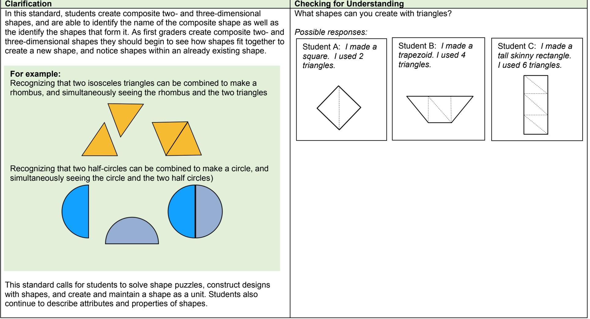

## 1st Grade Mathematics • Unpacked Contents

For the new Standard Course of Study that will be effective in all North Carolina schools in the 2017-18 School Year.

This document is designed to help North Carolina educators teach the 1* Grade Mathematics Standard Course of Study. NCDPI staff are continually updating and improving these tools to better serve teachers and districts.

## What is the purpose of this document?

The purpose of this document is to increase student achievement by ensuring educators understand the expectations of the new standards. This document may also be used to facilitate discussion among teachers and curriculum staff and to encouraqe coherence in the sequence, pacing, and units of study for grade-level curnicula. This document, along with on-going professional development, is one of many resources used to understand and teach the NC SCOS.

## What is in the document?

This document includes a detailed clarification of each standard in the grade level along with a sample of questions or directions that may be used during the instructional sequence to determine whether students are meeting the learning objective outlined by the standard. These items are included to support classroom instruction and are not intended to reflect summative assessment items. The examples included may not fully address the scope of the standard. The document also includes a table of contents of the standards organized by domain with hyperlinks to assist in navigating the electronic version of this instructional support tool.

## How do I send Feedback?

Please send feedback to us here and we will use your input to refine our unpacking of the standards. Thank You!

## Just want the standards alone?

You can find the standards alone at https://www.dpi.nc.gov/teach-nc/curriculum-instruction/standard-course-study/mathematics.

## North Carolina Course of Study - 1st Grade Standards

## Standards for Mathematical Practice

 Represent and solve problems. NC.1.0A.1 NC.1.0A.2 Understand and apply the properties of operations. NC.1.0A.3 NC.1.0A.4 Add and subtract within 20. NC.1.0A.9 NC.1.0A.6 Analyze addition and subtraction equations within 20. NC.1.0A.7 NC.1.0A.8

Extend and recognize patterns in the counting sequence. NC.1.NBT.1 NC.1.NBT.7 Understand place value. NC.1.NBT.2 NC.1.NBT.3 Use place value understanding and properties of operations. NC.1.NBT.4 NC.1.NBT.5 NC.1.NBT.6

Measure lengths. NC.1.MD.1 NC.1.MD.2 Build understanding of time and money. NC.1.MD.3 NC.1.MD.5 Represent and interpret data. NC.1.MD.4

Reason with shapes and their attributes. NC.1.G.1 NC.1.G.2 NC.1.G.3

## Standards for Mathematical Practice

| Practice |  | Explanation and Example |
| --- | --- | --- |
| 1. | Make sense of | Mathematically proficient students in First Grade continue to develop the ability to focus attention, test hypotheses, take reasonable risks, |
| problems and |  | remain flexible, try alternatives, exhibit self-regulation, and persevere (Copley, 2010). As the teacher uses thoughtful questioning and |
| persevere in |  | provides opportunities for students to share thinking, First Grade students become conscious of what they know and how they solve |
| solving them. |  | problems. They make sense of task-type problems, find an entry point or a way to begin the task, and are willing to try other approaches |
|  |  | when solving the task. They ask themselves, "Does this make sense?" First Grade students' conceptual understanding builds from their |
|  |  | experiences in Kindergarten as they continue to rely on concrete manipulatives and pictorial representations to solve a problem, |
|  |  | eventually becoming fluent and flexible with mental math as a result of these experiences. |
| 2. Reason |  | Mathematically proficient students in First Grade recognize that a number represents a specific quantity. They use numbers and symbols |
| abstractly and |  | to represent a problem, explain thinking, and justify a response. For example, when solving the problem: "There are 60 children on the |
| quantitatively. |  | playground. Some children line up. There are 20 children still on the playground. How many children lined up?" first grade students may |
|  |  | write 20 + 40 = 60 to indicate a Think-Addition strategy. Other students may illustrate a counting-on by tens strategy by writing 20 + 10 + |
|  |  | 10 + 10 + 10 = 60. The numbers and equations written illustrate the students' thinking and the strategies used, rather than how to simply |
|  |  | compute, and how the story is decontextualized as it is represented abstractly with symbols. |
| 3. | Construct | Mathematically proficient students in First Grade continue to develop their ability to clearly express, explain, organize and consolidate |
| viable |  | their math thinking using both verbal and written representations. Their understanding of grade appropriate vocabulary helps them to |
| arguments and |  | construct viable arguments about mathematics. For example, when justifying why a particular shape isn't a square, a first grade student |
| critique the |  | may hold up a picture of a rectandle, pointing to the various parts, and reason, "It can't be a square because, even though it has 4 sides |
| reasoning of |  | and 4 angles, the sides aren't all the same size." In a classroom where risk-taking and varyinq perspectives are encouraged, |
| others. |  | mathematically proficient students are willing and eager to share their ideas with others, consider other ideas proposed by classmates, |
|  |  | and question ideas that don't seem to make sense. |
| 4. | Model with | Mathematically proficient students in First Grade model real-life mathematical situations with a number sentence or an equation, and |
| mathematics. |  | check to make sure that their equation accurately matches the problem context. They also use tools, such as tables, to help collect |
|  |  | information, analyze results, make conclusions, and review their conclusions to see if the results make sense and revising as needed. |
| 5. Use |  | Mathematically proficient students in First Grade have access to a variety of concrete (e.g. 3-dimensional solids, ten frames, number |
| appropriate |  | balances, number lines) and technological tools (e.g., virtual manipulatives, calculators, interactive websites) and use them to investigate |
| tools |  | mathematical concepts. They select tools that help them solve and/or illustrate solutions to a problem. They recognize that multiple tools |
| strategically. |  | can be used for the same problem- depending on the strategy used. For example, a child who is in the counting stage may choose |
|  |  | connecting cubes to solve a problem. While, a student who understands parts of number, may solve the same problem using ten-frames |
|  |  | to decompose numbers rather than using individual connecting cubes. As the teacher provides numerous opportunities for students to |
|  |  | use educational materials, first grade students' conceptual understanding and higher-order thinking skills are developed. |
| 6. Attend to |  | Mathematically proficient students in First Grade attend to precision in their communication, calculations, and measurements. They are |
| precision. |  | able to describe their actions and strategies clearly, using grade-level appropriate vocabulary accurately. Their explanations and |
|  |  | reasoning regarding their process of finding a solution becomes more precise. In varying types of mathematical tasks, first grade students |
|  |  | pay attention to details as they work. For example, as students' ability to attend to position and direction develops, they begin to notice |
|  |  | reversals of numerals and self-correct when appropriate. When measuring an object, students check to make sure that there are not any |
|  |  | gaps or overlaps as they carefully place each unit end to measure the object (iterating length units). Mathematically proficient first |
|  |  | grade students understand the symbols they use (= >,<) and use clear explanations in discussions with others. For example, for the |
|  |  | sentence 4 > 3, a proficient student who is able to attend to precision states, "Four is more than 3" rather than "The alligator eats the four. |
|  |  | It's bigger." |

| 7. Look for and | Mathematically proficient students in First Grade carefully look for patterns and structures in the number system and other areas of |
| --- | --- |
| make use of | mathematics. For example, while solving addition problems using a number balance. students recognize that regardless whether you put |
| structure. | the 7 on a peg first and then the 4, or the 4 on first and then the 7, they both equal 11 (commutative property). When decomposing two- |
|  | digit numbers, students realize that the number of tens they have constructed 'happens' to coincide with the digit in the tens place. When |
|  | exploring geometric properties, first graders recognize that certain attributes are crilical (number of sides, angles), while other properties |
|  | are not (size, color, orientation). |
| 8. Look for and | Mathematically proficient students in First Grade begin to look for reqularity in problem structures when solving mathematical tasks. For |
| express | example, when adding three one-digit numbers and by making tens or using doubles, students engage in future tasks looking for |
| regularity in | opportunities to employ those same strategies. Thus, when solving 8+7+2, a student may say, "I know that 8 and 2 equal 10 and then I |
| repeated | add 7 more. That makes 17. It helps to see if I can make a 10 out of 2 numbers when I start." Further, students use repeated reasoning |
| reasoning. | while solving a task with multiple correct answers. For example, in the task "There are 12 crayons in the box. Some are red and some are |
|  | blue. How many of each could there be?" First Grade students realize that the 12 crayons could include 6 of each color (6+6 = 12), 7 of |
|  | one color and 5 of another (7+5 = 12), etc. In essence, students repeatedly find numbers that add up to 12. |

## Operations and Algebraic Thinking

| Represent and solve problems. |  |  |  |
| --- | --- | --- | --- |
| NC.1.OA.1 Represent and solve addition and subtraction word problems, within 20, with unknowns, by using objects, drawings, and equations with a symbol |  |  |  |
| for the unknown number to represent the problem, when solving: |  |  |  |
| ● Add to/Take from-Change Unknown |  |  |  |
| • Put together/Take Apart-Addend Unknown |  |  |  |
| ● Compare-Difference Unknown |  |  |  |
| Clarification | Checking for Understanding |  |  |
| In this standard, students extend their work from NC.K.OA.1 to solve addition and subtraction | Nine bunnies were sitting on the grass. Some more bunnies |  |  |
| problems within 20. In addition to continuing work with the problem types introduced in | hopped there. Now, there are 13 bunnies on the grass. How |  |  |
| Kindergarten, standard NC.1.OA.1 calls for first graders to work additional problem types, | many bunnies hopped over there? |  |  |
| including: |  |  |  |
| ● add to/take from – change unknown Possible response: |  |  |  |
| ● put together/take apart – addend unknown | Counting On: Niiinnneee holding a finger for each |  |  |
| ● compare – difference unknown | next number counted 10, 11, 12, 13. Holding up her four |  |  |
| fingers, 4! 4 bunnies hopped over there." |  |  |  |
| Result Unknown Change Unknown |  |  |  |
| Two birds sat in a tree. Three more Two birds sat in a tree. Some more | 13 apples are on the table. 6 of them are red and the rest are |  |  |
| birds fly to the tree. How many birds birds flew there. Then there were five | green. How many apples are green? |  |  |
| are in the tree now? birds in the tree. How many birds Add To |  |  |  |
| flew over to the first two? |  |  | Possible response: |
| 2 + 3 = ? |  |  |  |
| uoito A K 2 + ? = 5 | is 13. There are 7 green apples. |  |  |
| flew away. How many birds are in the |  | away. Then there were three birds in |  |
| Take From tree now? the tree. How many birds flew away? |  |  |  |
| 5 - 2 = ? 5 - ? = 3 1 |  |  |  |
| Both Addends |  |  |  |
|  | 15 |  |  |
| Three red birds and two Five birds are in a tree. Five birds are in a tree. |  |  |  |
| blue birds are in a tree. Three are red and the They could either be 8 | ? |  |  |
| How many birds are in rest are blue. How many blue birds or red birds. |  |  |  |
| the tree? birds are blue? How many birds could |  |  |  |
| oitɔA ol Together/ 3 + 2 = ? 3 + ? could be blue? |  |  |  |
| 5 – 3 = ? Take Apart |  |  |  |
| 5 = 0 + 5 5 = 5 + 0 |  |  |  |
| 5 = 4 + 1 5 = 1 + 4 |  |  |  |
| 5 = 2 + 3 5 = 3 + 2 |  |  |  |
| K 1 K |  |  |  |
| for the operations of addition and subtraction. |  |  |  |
| Doubles +/- 1 or 2: I know that 6 and 6 is 12. So, 6 and 7 |  |  |  |
| Five birds were in a tree. Two birds Five birds were in a tree. Some flew |  |  |  |
| Joe has 8 red balloons and some blue balloons. Joe has a |  |  |  |
| total of 15 balloons. How many blue balloons does Joe have? |  |  |  |
| V Possible response: |  |  |  |
| Total Unknown Addend Unknown |  |  |  |
| Unknown |  |  |  |
| Put be red and how many |  |  |  |
| As students develop strategies for solving a variety of problem situations, they build meaning |  |  |  |

## Represent and solve problems.

NC.1.OA.f Represent and solve addition and subtraction word problems, within 20, with unknowns, by using objects, drawings, and equations with a symbol for the unknown number to represent the problem, when solving:

- · Add to/Take from-Change Unknown
- Put together/Take Apart-Addend Unknown
- · Compare-Difference Unknown

| Clarification | Checking for Understanding |
| --- | --- |
| Change unknown and addend unknown problems allow students to begin to see subtraction as |  |
| the opposite of addition. Developing the understanding of subtraction as an unknown addend |  |
| addition problem is an essential goal for later mathematics. As students work with change |  |
| unknown and addend unknown problems, they will record situation equations (equations in |  |
| which the operation and order of numbers matches the situation of the problem). Eventually, |  |
| students notice that a problem may be solved with other solution equations (equations that |  |
| lead to the answer, but do not match the situation of the story). |  |
| In a Compare situation, two amounts are compared to find "How many more" or "How many |  |
| less/fewer". Students build on their understanding of equal to, more than, and less than for two |  |
| groups of objects or two numbers. Strategies for determining which the difference in quantities |  |
| include matching and counting. |  |
| Difference Unknown |  |
| "How manv more?" version |  |
| Compare |  |
| As First Graders work with a variety of problem types, they extend the sophistication of addition |  |
| and subtraction methods used in Kindergarten (counting). Now, students use methods of |  |
| counting on, making ten, and doubles +/- 1 or +/- 2 to solve problems. Students also use a |  |
| variety of models, including discrete objects and length-based models (e.q., cubes connected |  |
| to form lengths). |  |
| In order for students to read and use equations to represent their thinking, they need extensive |  |
| experiences with addition and subtraction situations in order to connect the experiences with |  |
| symbols (+. -. =) and equations (5=3+2). In Kindergarten, students demonstrated the |  |
| understanding of how objects can be joined (addition) and separated (subtraction) by |  |
| representing addition and subtraction situations using objects, pictures and words. In First |  |
| Grade, students extend this understanding of addition and subtraction situations to use the |  |
| addition symbol (+) to represent joining situations, the subtraction symbol (-) to represent |  |
| separating situations, and the equal sign (=) to represent a relationship regarding quantity |  |
| between one side of the equation and the other. When solving comparison problems, students |  |
| may write various equations to represent comparisons. |  |
| For a complete chart of problem types see page 30. |  |

## Represent and solve problems.

NC.1.OA.2 Represent and solve word problems that call for addition of three whole numbers whose sum is less than or equal to 20, by using objects, drawings. and equations with a symbol for the unknown number.

| Clarification | Checking for Understanding |
| --- | --- |
| Students solve multi-step word problems by adding (joining) three numbers | Mrs. Smith has 4 oatmeal raisin cookies, 5 chocolate chip cookies, and 6 |
| whose sum is less than or equal to 20, using a variety of mathematical | gingerbread cookies. How many cookies does Mrs. Smith have? |
| representations. |  |
|  | Possible responses: |
| Standard NC.1.0A.2 builds the groundwork for NC.1.OA.6, where students | Student A: |
| develop computation strategies such as near doubles (e.g., 5+6 can be | l put 4 counters on the Ten Frame for the oatmeal raisin cookies. Then, l |
| solved by adding 5+5+1) and making ten (e.g., 9+6 can be solved by adding | put 5 different color counters on the ten frame for the chocolate chip |
| 1 to 9, then adding 5. | cookies. Then, I put another 6 color counters out for the gingerbread |
|  | cookies. Only one of the gingerbread cookies fit, so I had 5 leftover. Ten |
| Explicit connections to the properties of addition (commutative and | and five more makes 15 cookies. Mrs. Smith has 15 cookies. |
| associative properties) should be made to provide students with opportunities | 4 + 5 + 6 = |
| to develop strategies for addition including making 10, using open number |  |
| lines, and counting up. |  |
| Students should have numerous experiences with concrete models and |  |
| pictures before moving to writing equations. |  |
|  | Student B: |
|  | l used a number line. First, I jumped to 4, and then I jumped 5 more. |
|  | That's 9. I broke up 6 into 1 and 5 so I could jump 1 to make 10. Then, l |
|  | jumped 5 more and got 15. Mrs. Smith has 15 cookies. |
|  | 15 |
|  | Student C: l wrote: 4 + 5 + 6 = □. l know that 4 and 6 equals 10, so the oatmeal |
|  | raisin and gingerbread equals 10 cookies. Then I added the 5 chocolate |
|  | chip cookies. 10 and 5 is 15. So, Mrs. Smith has 15 cookies. |

Return to Standards

| Understand and apply the properties of operations. |  |  |
| --- | --- | --- |
| NC.1.OA.3 Apply the commutative and associative properties as strategies for solving addition problems. |  |  |
| Clarification |  | Checking for Understanding |
| This standard calls for students to notice properties of operations as they |  | Commutative Property Examples: |
| work with numbers, and apply their understandings of the commutative and |  |  |
| associative property to solve addition problems. Students use mathematical |  | Cubes: |
| tools and representations (e.g., cubes, counters, number balance, number |  | A student uses 2 colors of cubes to make as many different combinations of 8 |
| line, 100 chart) to model these ideas. |  | as possible. When recording the |
| combinations, the student records that |  | 3 + 5 = 8 |
| Students in first grade do not use the formal terms "commutative" and |  | 3 green cubes and 5 blue cubes |
| "associative". |  | equals 8 cubes in all. In addition, the 5 + 3 = 8 |
| student notices that 5 green cubes |  |  |
| and 3 blue cubes also equals 8 cubes. |  |  |
| Commutative Property | Associative Property |  |
| of Addition | of Addition | Number Balance: |
| The order of the addends does | The grouping of the 3 or more | A student uses a number balance to investigate the commutative property. "If 8 |
| not change the sum. | addends does not affect the sum. | and 2 equals 10, then I think that if I put a weight on 2 first this time and then on |
| 8, it'll also be 10." |  |  |
| For example, if | For example, when adding 2 + 6 + 4, |  |
| 8 + 2 = 10 is known, then | the sum from adding the first two |  |
| 2 + 8 = 10 is also known. | numbers first (2 + 6) and then the |  |
| third number (4) is the same as if the |  |  |
| second and third numbers are |  |  |
| added first (6 + 4) and then the first |  |  |
| number (2). The student may note |  |  |
| that 6+4 equals 10 and add those |  |  |
| Associative Property Examples: There are 5 red jelly beans, 4 green jelly | two numbers first before adding 2. |  |
| beans, and 5 black jelly beans. How many jelly beans are there in all? | Regardless of the order, the sum |  |
| remains 12. |  | Number Line: |
| Student A: First I jumped to 5. Then, I |  |  |
| jumped 4 more, so I landed on 9. Then, |  |  |
| l jumped 5 more and landed on 14. |  | 14 |
| Student B: I got 14, too, but I did it a |  |  |
| different way. First, I jumped to 5. Then, |  |  |
| l jumped 5 again. That's 10. Then, |  |  |
| I jumped 4 more. See, 14! |  | 14 D |
| Mental Math: |  |  |
| Student: I started by adding 5 and 5 because I know that makes 10. Then, I |  |  |
| added 49. That's 14. |  |  |

Return to Standards

| Understand and apply the properties of operations. |  |
| --- | --- |
| NC.1.OA.4 Solve an unknown-addend problem, within 20, by using addition strategies and/or changing it to a subtraction problem. |  |
| Clarification | Checking for Understanding |
| In this standard, students find the solution to a problem based on the | Francisco was making cards for his 12 friends. He already made 4 cards. How |
| meaning in the story. Therefore, when faced with an unknown addend | many cards does Francisco still need to make? |
| problem, students may associate the problem with either addition or |  |
| subtraction, depending on the context. | Student A: I started at 4 and added up to 12 (4 + = 12) |
|  | Student B: I thought about subtraction problem (12 – 4 = |
| This standard calls for students to make sense of unknown addend problems |  |
| and demonstrate flexibility in solving. Through experiences, students will | Think Addition |
| notice the relationship between addition and subtraction, and apply this | 2 + ロ = 10 |
| relationship when problem solving (i.e., by changing an unknown addend | 10 – 2 = ロ |
| problem so a subtraction problem). |  |
|  | Student: 2 and what make 10?   know that 8 and 2 make 10. So. 10 – 2 = |
| Additionally, students should develop flexibility when solving unknown | 8. |
| addend problems, using strategies such as: |  |
| ● direct modeling | Build Up Through 10 |
| count on/count back |  |
| ● | 15 - 9 = ロ |
| ● use derived facts |  |
| make a ten ● | Student A: I'll start with 9. I need one more to make 10. Then, I need 5 |
| ● think addition | more to make 15. That's 1 and 5- so it's 6. 15 – 9 = 6. |
| ● think subtraction |  |
| ● subtract through ten | Student B: I put 9 counters on the 10 frame. Just |
|  | looking at it I can tell that I need 1 more to get to 10. |
|  | Then I need 5 more to get to 15. So, I need 6 |
|  | counters. |
|  | Back Down Through 10 |
| 16 – 7 = ロ |  |
|  | Student A: I'll start with 16 and take off 6. That makes 10. I'll take one |
|  | more off and that makes 9. 16 – 7 = 9. |
|  | Student B: I used 16 counters to fill one ten frame |
|  | completely and most of the other one. Then, I can take |
|  | these 6 off from the 2nd ten frame. Then, I'll take one |
|  | more from the first ten frame. That leaves 9 on the ten |
|  | frame. |

| Add and subtract within 20. |  |  |
| --- | --- | --- |
| NC.1.OA.9 Demonstrate fluency with addition and subtraction within 10. |  |  |
| Clarification | Checking for Understanding |  |
| In this standard, students learn about and use a variety of strategies to solve |  | Two frogs were sitting on a log. 6 more frogs hopped there. How many frogs |
| addition and subtraction problems (See strategies listed in NC.1.OA.6). As | are sitting on the log now? |  |
| these strategies are repeatedly used in ways that make sense to the |  |  |
| students, they begin to understand and internalize the relationships that exist | Possible responses: |  |
| between and among numbers. This leads to fluency. When students | Counting- On | Internalized Fact |
| develop fluency within 10, they display accuracy, efficiency, and flexibility. | l started with 6 frogs and then | There are 8 frogs on the log. |
| First Graders then apply similar strategies for solving problems within 20, | counted up. Sixxxx 7. 8. So | know this because 6 plus 2 equals |
| building the foundation for fluency to 20 in Second Grade. | there are 8 frogs on the log. | 8. |
|  | 6 + 2 = 8 | 6 + 2 = 8 |
| Traditional flash cards or timed tests have not been proven as effective |  |  |
| instructional strategies for developing fluency. Often, when children think of |  |  |
| each "fact" as an individual item that does not relate to any other "fact", they |  |  |
| are attempting to memorize separate bits of information that can be easily |  |  |
| forgotten. Numerous experiences with breaking apart actual sets of objects |  |  |
| and developing relationships between numbers help children internalize parts |  |  |
| of number and develop efficient strategies for fact retrieval. |  |  |

## Add and subtract within 20.

NC.1.OA.6 Add and subtract, within 20. using strategies such as:

- · Counting on
- Making ten ●
- Decomposing a number leading to a ten
- Using the relationship between addition and subtraction
- Using a number line
- . Creating equivalent but simpler or known sums.

#### Clarification In this standard, students develop increasingly sophisticated strategies to become more

efficient with addition and subtraction. Students are flexible as they decide when each strategy is the most efficient. Students should be able to explain their thinking and the strategy they have chosen to use.

| Examples of Strategies: |  | Make 10 and Decompose a | Create an Easier Problem with |
| --- | --- | --- | --- |
| Counting On | Making Ten | Number | Known Sums |
| Counting on can be used to add (find a total) or | This strategy makes a problem friendlier by taking 1 | l know that 8 plus 2 is 10, so l | l broke up (decomposed) 8 |
| subtract (find an unknown addend). Students see | or more from one addend and adding it to the other | broke up (decomposed) the 7 | into 7 and 1. I know that 7 |
| the first addend as part of the total and count on the | addend, making 10. | up into a 2 and a 5. First, I | and 7 is 14. I added 1 more to |
| find the other part. This may be accompanied with |  |  |  |
| fingers or mental images. Counting on is meant to Example: |  | added 8 and 2 to get 10, and | aet 15. |
| be a thinking strategy, not a rote method. | When solving 9+6, a student moves 1 from the 6 to | then added the 5 to get 15. |  |
| the 9. The new problem becomes 10+5. |  | 7 = 2 + 5 | 8 = 7 + 1 |
| Example: 15 + = 18 |  | 8 + 2 = 10 | 7 + 7 = 14 |
| "I put 15 in my head and |  |  |  |
|  |  | 10 + 5 = 15 | 14 + 1 = 15 |
| counted on until I got to 18. I |  |  |  |
| said 3 numbers so I know the |  |  |  |
| missing part is 3." |  | There were 14 birds in the tree. 6 flew away. How many birds |  |
| Decomposing a Number Leading to Ten | Using the Relationship Between Addition | are in the tree now? |  |
| Here, part of the subtrahend is subtracted, getting a | and Subtraction |  |  |
| difference of 10. Then, the remaining part of the | When students understand that any addition or | Possible responses: |  |
| subtrahend is subtracted. | subtraction equation has several related equations |  |  |
| (i.e., fact families), this relationship may be used to |  | Decomposing a Number Leading | Relationship between Addition & |
| Example: |  | to Ten | Subtraction |
| solve problems. |  |  |  |
|  |  | l know that 14 minus 4 is 10. | I thought, '6 and what makes |
| "Instead of suptracting o, I started by subtracting 4, | Example: 19 - 11 = | So, I broke the 6 up into a 4 | 14?'. I know that 6 plus 6 is |
| getting a difference of 10. Then, I still had to | "I know the sum of 11 and 8 is 19. That helps me | and a 2. 14 minus 4 is 10. | 12 and two more is 14. That's |
| subtract 2. That's 8." |  |  |  |
| know that if I take away 11 from 19, I'm left with 8." |  | Then I took away 2 more to | 8 altogether. So, that means |
| Using a Number Line | Creating an Equivalent Sum | aet 8. | that 14 minus 6 is 8. |
| A number line may be used to help keep track of | Students recognize a close, easy fact to help them |  |  |
| work, especially when a student adds or subtracts | solve a trickier problem | 6 = 4 + 2 | 6 + 8 = 14 |
| in chunks. |  | 14 - 4 = 10 | 14 - 6 = 8 |
| Example: |  | 10 - 2 = 8 |  |
| Example: | "6+5 is tricky. Instead, I'll start with 5+5, then add 1 |  |  |
| 15 - 8 more." |  |  |  |
| 10 15 |  |  |  |
| Here, the student first subtracts 5 to get to 10, then |  |  |  |
| he subtracts the remaining 3. |  |  |  |
|  |  |  | Return to Standards |

Checking for Understanding

marbles does Sam have in all?

Possible responses:

Sam has 8 red marbles and 7 green marbles. How many

North Carolina Department of Public Instruction

| Analyze addition and subtraction equations within 20. |  |  |
| --- | --- | --- |
| NC.1.OA.7 Apply understanding of the equal sign to determine if equations involving addition and subtraction are true. |  |  |
| Clarification | Checking for Understanding |  |
| In this standard, students develop an understanding of the meaning of the | Put these cards into two piles: True and Not True. Use objects, drawings, or |  |
| equal sign and apply their understanding in order to determine whether an | words to explain your thinking. |  |
| equation is true. This is developed as students in Kindergarten and First |  |  |
| Grade solve numerous joining and separating situations with mathematical | 8 = 8 |  |
| tools, rather than symbols. Once the concepts of joining, separating, and "the |  |  |
| same amount/quantity as" are developed concretely, First Graders are ready |  | 9 = 9 + 1 |
| to connect these experiences to the corresponding symbols (+, -, =). | 8 + 3 = 10 |  |
| Students learn that the equal sign does not mean "the answer comes next", |  |  |
| but that the symbol signifies an equivalent relationship that the left side 'has |  | 4 + 3 = 3 + 4 |
| the same value as' the right side of the equation. |  |  |
|  | Possible responses: |  |
| When students understand that an equation needs to "balance", with equal |  |  |
| quantities on both sides of the equal sign, they understand various | 9 = 9 + 1 | 4 + 3 = 3 + 4 |
| representations of equations, such as: |  |  |
|  |  | It's like a balance. Both sides are |
| • operation on left side of the equal sign, and answer on right side (5+8=13) | The equal sign means both sides | balanced because they have the |
| · operation on right side of the equal sign and answer on left side (13=5+8) |  |  |
|  | have the same amount. The one | same amount. The numbers are |
| · numbers on both sides of the equal sign (6=6) | side has nine, and the other side has | flipped around, but both sides have |
| · operations on both sides of the equal sign (5+2 = 4+3). |  |  |
|  | ten. Nine and ten aren't equal. | seven. |
| Once students understand the meaning of the equal sign, they are able to |  |  |
| determine if an equation is true (9 = 9) or not true (9 = 8). |  |  |
| Analyze addition and subtraction equations within 20. |  |  |

| NC.1.OA.8 Determine the unknown whole number in an addition or subtraction equation involving three whole numbers. |  |  |
| --- | --- | --- |
| Checking for Understanding |  | Clarification |
| Five cookies were on the table. I ate some cookies. Then there were 3 cookies. |  | In this standard, students use their understanding of strategies related to |
| How many cookies did I eat? |  | addition and subtraction to solve equations with an unknown. Rather than |
| Student A: What goes Student B: Fiiivee, four, | Student C: We ended | letters, the unknown symbols are boxes or pictures. |
| with 3 to make 5? 2 three (holding up 1 | with 3 cookies. |  |
| Students should begin writing equations with unknowns to solve problems. |  |  |
| and 3 make 5. 2 finger for each count). 2 | Threeeee, four, five | Given an equation with an unknown, students should be able to explain their |
| cookies were eaten. cookies were eaten | (holding up 1 finger for |  |
| (showing 2 fingers). | each count). 2 cookies | reasoning as they find the unknown value. |
|  | were eaten (showing 2 |  |
|  | fingers). |  |
| Find the unknown number that makes the equation true: 5-□=2 |  |  |
| Student: 5 minus something is the same amount as 2. Hmmm. 2 and what |  |  |
| makes 5? 3! So. 5 minus 3 equals 2. Now it's true! |  |  |

## Number and Operations in Base Ten

| Extend and recognize patterns in the counting sequence |  |
| --- | --- |
| NC.1.NBT.1 Count to 150, starting at any number less than 150. |  |
| Clarification | Checking for Understanding |
| This standard calls for students to rote count from a given number without | Sample Student Interview: |
| having to go back and start at one. Students should develop accurate | Teacher: Begin at 88 and count up to 102 |
| counting strategies that build on the understanding of how the numbers in the | Student: 88, 89 ... umm ... 90, 91, 92, 93, 94, 95, 96, 97, 98, |
| counting sequence are related—each number is one more (or one less) than | 99...umm...100, 101 |
| the number before (or after). |  |
|  | Teacher: I noticed you paused to think at 89. How did you figure out the next |
| This skill builds from counting work in Kindergarten, and serves as a number? |  |
| prerequisite skill for counting on to add. | Student: After each number that ends in 9, comes a number that ends in 0. |
| So, I remembered the next number is 90. |  |
| The focus of this standard is rote counting only, and does not require |  |
| recognition of numerals or writing numerals. |  |
| Extend and recognize patterns in the counting sequence |  |
| NC.1.NBT.7 Read and write numerals, and represent a number of objects with a written numeral, to 100. |  |
| Clarification | Checking for Understanding |
| This standard calls for students to read and write numerals to represent a | Teacher: How many buttons are in this bag? Use the number cards to show the |
| qiven amount. amount. |  |
| When determining the quantity of a set within 100, students will |  |
| ● |  |
| select the appropriate number card/tile (numeral recognition) or write |  |
| the numeral. |  |
| ● When given a numeral or number card/tile, students will create a set |  |
| of items that represents the numeral presented. |  |
| As students explore larger numbers and develop understanding of place | Student: I counted 31. I used these number cards to make 31. |
|  | 3 |
| value, they will recognize that the position of each digit in a number impacts |  |
| the quantity of the number. They become more aware of the order of the |  |
| digits when they write numbers. | Teacher: Use the buttons to make a set to match this number. |
| For example: | 2 Student: That's 27! Here are 27 buttons. |
| a student may write "17" and mean "71". Through teacher |  |
| demonstration, opportunities to "find mistakes", and questioning by the |  |
| teacher ("I am reading this and it says seventeen. Did you mean |  |
| seventeen or seventy-one? How can you change the number so that it |  |
| reads seventy-one?"), students become precise as they write numbers |  |
| to 100. |  |

## Understand place value.

NC.1.NBT.2 Understand that the two digits of a two-digit number represent amounts of tens and ones.

- · Unitize by making a ten from a collection of ten ones.
- · Model the numbers from 11 to 19 as composed of a ten and one, two, three, four, five, six, seven, eight, or nine ones.
- · Demonstrate that the numbers 10, 20, 30, 40, 50, 60, 70, 80, 90 refer to one, two, three, four, five, six, seven, eight, or nine tens, with 0 ones.

| Clarification | Checking for Understanding |
| --- | --- |
| The focus of this standard is to build place value understanding through tens. | Here is a pile of 12 cubes. Do you have enough to make a ten? Would you |
| First Grade students extend their work from Kindergarten when they | have any leftover? If so, how many leftovers would you have? |
| composed and decomposed numbers from 11 to 19 into ten ones and some |  |
| further ones. In Kindergarten, everything was thought of as individual units, | Student A: |
| "ones". In First Grade, students are asked to unitize those ten individual ones | I filled a ten frame to make a ten and had two |
| as a whole unit: "one ten". Students are introduced to the idea that a bundle | counters left over. The number 12 has 1 ten |
| of ten ones is called "a ten". This is known as unitizing. Students in first | and 2 ones. |
| grade explore the idea that the teen numbers (11 to 19) can be expressed as |  |
| one ten and some leftover ones. | Student B: |
|  | I counted out 12 cubes. I had enough |
| When students unitize a group of ten ones as a whole unit ("a ten"), they are | to make 10. I now have 1 ten and 2 |
| able to count groups as though they were individual objects. For example, 4 | cubes left over. The number 12 has 1 |
| trains of ten cubes each have a value of 10 and would be counted as 40 ones | ten and 2 ones. |
| or as 4 tens. This can often be challenging for young children to consider a |  |
| group of something as "one" when all previous experiences have been | Are the number 19 and 91 the same or different? (19 91) |
| counting single objects. This is the foundation of the place value system and |  |
| requires time and rich experiences with concrete manipulatives to develop. | Teacher: Are these numbers the same or different? |
|  | Students: Different! |
| In addition, when learning about forming groups of 10, students learn that a |  |
| numeral can stand for many different amounts, depending on its position or | Teacher: Why do you think so? |
| place in a number. This is an important realization as young children begin to | Student A: Even though they both have a one and a nine, I know the 1 in |
| work through reversals of digits, particularly in the teen numbers. | 19 represents one group of ten. The 1 in 91 represents 1 one. |
| Students apply their understanding of groups of ten to decade numbers (e.g. | Student B: I know the 9 in 91 represents nine groups of tens. The 9 in 19 |
| 10, 20, 30, 40). As they work with groupable objects, students understand | represents 9 ones. |
| that 10, 20, 30 ... 80, 90 are comprised of a certain amount of groups of tens |  |
| with none left-over. |  |
| A deep understanding of place value is developed over time as students have |  |
| ample experiences with a variety of groupable materials (i.e., materials that |  |
| can be grouped, snapped, or connected to make a ten). Pre-grouped |  |
| materials (i.e., materials like base ten blocks and bean sticks, which must be |  |
| traded to make a ten) are not introduced until a student has a firm |  |
| understanding of composing and decomposing ten. Additionally, students |  |
| should have access to proportional manipulatives, meaning the size of "ten" is |  |
| ten times bigger than one single manipulative. Coins could cause a |  |
| misconception with regards to developing an understanding of place value. |  |
|  | Return to Standards |

| Understand place value. |  |  |
| --- | --- | --- |
| NC.1.NBT.3 Compare two two-digit numbers based on the value of the tens and ones digits, recording the results of comparisons with the symbols > , - , and <. |  |  |
| Clarification | Checking for Understanding |  |
| In this standard, students use their understanding of groups and order of | Compare these two numbers. 42 45 |  |
| digits to compare two numbers by examining the amount of tens and ones in |  |  |
| each number. After numerous experiences verbally comparing two sets of | Possible responses: |  |
| objects using comparison vocabulary (e.g., 42 is more than 31. 23 is less |  |  |
| than 52, 61 is the same amount as 61.), first grade students connect the | Student A | Student B |
| vocabulary to the symbols: greater than (>), less than (<), equal to (=). | 42 has 4 tens and 2 ones. 45 has 4 | 42 is less than 45. I know this |
|  | tens and 5 ones. Thev have the | because when I count up I say 42 |
|  | same number of tens, but 45 has | before I say 45. |
|  | more ones than 42. So, 42 is less | 42 < 45 |
|  | than 45. |  |
|  | 42 < 45 |  |

## Use place value understanding and properties of operations.

NC . NBT.4 Using concrete models or drawings, strategies based on place value, properties of operations, and explaining the reasoning used, add, within 100, in the following situations:

· A two-digit number and a one-digit number

- · A two-digit number and a multiple of 10

| Clarification | Checking for Understanding | In this standard, students use concrete materials, models, drawings and | 24 red apples and 8 green apples are on the table. How many apples are on |
| --- | --- | --- | --- |
| place value strategies to add within 100. Students move beyond basic facts | the table? | and draw on their understanding of the base-ten system (i.e., composing |  |
| groups of ten from ten ones, and recognizing that a digit's value is determine | Possible responses: | by its place) to begin developing strategies for adding one and two digit | Student A: |
| numbers. | l used ten frames. I put 24 chips on 3 ten frames. Then, I counted out 8 | more chips. 6 of them filled up the third ten frame. That meant I had 2 left |  |
| The focus of this standard is to develop an understanding of multi-digit | over. 3 tens and 2 left over. That's 32. So, there are 32 apples on the | addition. The standard algorithm of carrying or borrowing is neither an | table. |
| expectation nor a focus in First Grade. Students develop strategies for | 24 + 6 = 30 | addition and subtraction in Grades K-3. |  |
| 30 + 2 = 32 |  |  |  |
| Student B: | I used an open number line. I started at 24. I knew that I needed 6 more |  |  |
| jumps to get to 30. So, I broke apart 8 into 6 and 2. I took 6 jumps to land | on 30 and then 2 more. I landed on 32. So, there are 32 apples on the |  |  |
| table. |  |  |  |
| 24 + 6 = 30 | 30 + 2 = 32 |  |  |
| 30 32 | 24 | Student C: |  |
| I turned 8 into 10 by adding 2 because it's easier to add. | So, 24 and ten more is 34. |  |  |
| But, since I added 2 extra, I had to take them off again. | 34 minus 2 is 32. There are 32 apples on the table. |  |  |
| 8 + 2 = 10 | 24 + 10 = 34 |  |  |
| 34 - 2 = 32 |  |  |  |

## Use place value understanding and properties of operations.

NC . NBT.4 Using concrete models or drawings, strategies based on place value, properties of operations, and explaining the reasoning used, add, within 100, in the following situations:

- · A two-digit number and a one-digit number
- A two-digit number and a multiple of 10 .

| Clarification | Checking for Understanding |  |  |  |  |  |  |  |  |  |  |
| --- | --- | --- | --- | --- | --- | --- | --- | --- | --- | --- | --- |
|  |  | 63 apples are in the basket. Mary put 20 more apples in the basket. How |  |  |  |  |  |  |  |  |  |
|  | many apples are in the basket? |  |  |  |  |  |  |  |  |  |  |
|  | Possible responses: |  |  |  |  |  |  |  |  |  |  |
|  | Student A: |  |  |  |  |  |  |  |  |  |  |
|  | l used ten frames. I picked out 6 |  |  |  |  |  |  |  |  |  |  |
|  | filled ten frames. That's 60. I got |  |  |  |  |  |  |  |  |  |  |
|  | the ten frame with 3 on it. That's |  |  |  |  |  |  |  |  |  |  |
|  | 63. Then, I picked one more filled |  |  |  |  |  |  |  |  |  |  |
|  | ten frame for part of the 20 that |  |  |  |  |  |  |  |  |  |  |
|  | Mary put in. That made 73. Then, l got one more filled ten frame to |  |  |  |  |  |  |  |  |  |  |
|  | make the rest of the 20 apples |  |  |  |  |  |  |  |  |  |  |
|  | from Mary. That's 83. So, there are 83 apples in |  |  |  |  |  |  |  | 63 + 10 = 73 |  |  |
|  | the basket. |  |  |  |  |  |  |  | 73 + 10 = 83 |  |  |
|  | Student B: | 1 | 2 | 3 | 4 | રે | ୧ | 7 | 8 | ਰੇ | 10 |
|  | l used a hundreds chart. I |  |  |  |  |  |  |  |  |  |  |
|  |  | 11 | 12 | 13 | 14 | I રે | I Q | 17 | 18 | 19 | 20 |
|  | started at 63 and jumped down | 21 | 22 | 23 | 24 | 25 | 26 | 27 | 28 | 29 | 30 |
|  | one row to 73. That means I |  |  |  |  |  |  |  |  |  |  |
|  | moved 10 spaces. Then, I | 31 | 32 | 33 | 34 | 3 રે | 36 | 37 | 38 | 39 | 40 |
|  | jumped down one more row | 41 | 42 | 43 | 44 | વર | 46 | 47 | 48 | 49 | 50 |
|  | (that's another 10 spaces) and | ર I | 52 | રેઝ | રે રે | રેર | રેર | 57 | રેક | રતે | ୧୦ |
|  | landed on 83. So, there are 83 |  | 62 |  | 64 |  |  |  |  |  |  |
|  | apples in the basket. | QI |  | 63 |  | ୧ર | 66 | 67 | 68 | ୧୪ | 70 |
|  |  | 71 | 72 | 73 | 74 | 75 | 76 | 77 | 78 | 79 | 80 |
|  | 63 + 10 = 73 | 81 | 82 | 83 | 84 | 8ર | 86 | 87 | 88 | 89 | 90 |
|  | 73 + 10 = 83 | 91 | 92 | 93 | 94 | તેર | તેર | 97 | 98 | 99 | 100 |
|  | Student C: |  |  |  |  |  |  |  |  |  |  |
|  |  | I knew that 10 more than 63 is 73. And 10 more than 73 is 83. So, there |  |  |  |  |  |  |  |  |  |
|  | are 83 apples in the basket. |  |  |  |  |  |  |  |  |  |  |

Return to Standards

| Use place value understanding and properties of operations. |  |
| --- | --- |
| NC.1.NBT.5 Given a two-digit number, mentally find 10 more or 10 less than the number, without having to count; explain the reasoning used. |  |
| Clarification | Checking for Understanding |
| In this standard, students build on their counting by tens work in Kindergarten | There are 74 birds in the park. 10 birds fly away. How many birds are in the |
| by mentally adding ten more and ten less than any number less than 100. | park now? |
| First graders are not expected to compute differences of two-digit numbers |  |
| other than multiples of ten. | Possible responses: |
|  | Student A |
| Using representations that allow students to think about groups of ten leads | l thought about a number line. I started at 74. Then, because 10 birds |
| them to moving beyond rote counting and into being able to solve these | flew away, I took a leap of 10. I landed on 64. So, there are 64 birds left |
| problems mentally. Students should be able to explain their reasoning using | in the park. |
| manipulatives, pictures, numbers, or words. |  |
|  | Student B |
|  | I pictured 7 ten frames and |
|  | 4 left over in my head. |
|  | Since 10 birds flew away, I |
|  | took one of the ten frames |
|  | away. That left 6 ten |
|  | frames and 4 left over. So. |
|  | there are 64 birds left in |
|  | the park. |
|  | Student C |
|  | I know that 10 less than 74 is 64. So, there are 64 birds in the park. |

| Use place value understanding and properties of operations. |  |  |
| --- | --- | --- |
| NC.1.NBT.6 Subtract multiples of 10 in the range 10-90 from multiples of 10 in the range 10-90, explaining the reasoning, using: |  |  |
| ● Concrete models and drawings |  |  |
| ● Number lines |  |  |
| ● Strategies based on place value |  |  |
| ● Properties of operations |  |  |
| ● The relationship between addition and subtraction |  |  |
| Clarification | Checking for Understanding |  |
| This standard calls for students to move beyond determining "10 less" to work | There are 60 students in the gym. 30 students leave. How many students are |  |
| with multiples of 10. Students use concrete models, drawings, place value | still in the gym? |  |
| strategies, and the relationship between addition and subtraction to subtract |  |  |
| multiples of 10 from decade numbers (e.g., 30, 40, 50). | Possible responses: |  |
|  | Student A |  |
| First graders are not expected to compute differences of two-digit numbers | l used a number line. I started at 60 and moved back 3 jumps of 10 and |  |
| other than multiples of ten. Students are expected to explain their reasoning | landed on 30. There are 30 students left. |  |
| using pictures, numbers, or words. |  |  |
|  | 10 10 10 60 - 10 = 50 |  |
|  | 50 - 10 = 40 |  |
|  | 40 - 10 = 30 30 40 50 | 60 |
|  | Student B |  |
|  | l used ten frames. I had 6 ten frames- that's 60. I removed three ten |  |
|  | frames because 30 students left the gym. There are 30 students left in the gym. |  |
|  | 60 - 30 = 30 |  |
|  | Student C |  |
|  |  | I thought, "30 and what makes 60?". I know 3 and 3 is 6. So, I thought |
|  | that 30 and 30 makes 60. There are 30 students still in the gym. |  |
|  | 30 + 30 = 60 |  |

## Measurement and Data

| Measure lengths. |  |
| --- | --- |
| NC.1.MD.1 Order three objects by length; compare the lengths of two objects indirectly by using a third object. |  |
| Clarification | Checking for Understanding |
| In this standard, students build on their understanding of direct comparison to | The pet store owner is trying to put the hamsters in order- from shortest to |
| compare lengths. Students will understand that length is measured from one | longest. She knows that the black hamster is longer than the gray hamster |
| endpoint to another, and that by aligninq objects it is possible to determine | and the gray hamster is longer than the brown hamster. |
| which object is longer/shorter or taller/shorter. |  |
|  | Possible response: |
|  | Since the black hamster is longer than the gray hamster and the gray |
| Students also are expected to apply the concept of transitivity in two ways. | hamster is longer than the brown hamster, the brown hamster is the |
| First, students can look at the direct relationship of objects to compare the |  |
| relationship between 3 objects. For example, the blue crayon is longer than | shortest. Then the next shortest is the gray hamster. The longest hamster |
|  | is the black hamster. So, it is black hamster, gray hamster, brown |
| the red crayon, and the red crayon is longer than the yellow crayon. Based on | hamster. |
| the relationships the student also can conclude that the blue crayon is longer |  |
| than the yellow crayon. | Juanita needs to decide whether Mrs. Lopez can put a new desk in a space on |
|  | the wall before moving the desk. How can Juanita use a piece of string to help |
| Second, students are expected to apply transitivity to order two objects that | Mrs. Lopez? |
| may not be able to be moved. For example, to compare the length of a |  |
| bookshelf to the length of a desk, you could cut a string that is the same length | Possible response: |
| as the bookshelf. You can then compare the piece of string with the desk. If | Juanita can cut the string so that it is the same as the desk. Then she |
| the string is longer than the desk, then you know that the bookshelf is longer | can take the string to the space on the wall to see if the string will fit. If |
| than the desk. | she stretches out the string out straight across and fits then the desk will |
|  | fit. If it doesn't fit then it won't fit. |

Return to Standards

## Measure lengths.

NC.1.MD.2 Measure lengths with non-standard units.

- · Express the length of an object as a whole number of non-standard length units.
- · Measure bv laving multible copies of a shorter object (the length unit) end to end (iterating) with no gaps or overlaps

| Clarification | Checking for Understanding |
| --- | --- |
| This standard focuses on using non-standard units such as paper clips or | Measure this pencil using non-standard units |
| cubes to determine the length of an object. In this standard, they learn to |  |
| measure with iterations of non-standard units, using multiple copies of one |  |
| object to measure the length of a larger object. These can be labeled length- |  |
| units. Students will understand that when measuring an object, there should |  |
| be no gaps between length units and the length units should not overlap. | Possible Response: I carefully placed paper clips end to end. The pencil |
| Students should already have an understanding of direct comparison. | is 5 paper clips long. I thought it would take about 6 paperclips. |
|  | Which row is longer? Explain how you know. |
| Students will also understand then when different sized units are used to |  |
| measure the same object, the sizes of the units must be considered rather |  |
| than relying solely on the amount of objects counted. |  |
|  | Student Incorrect Response: The row with 6 sticks is longer. Row B is |
|  | longer. |
|  | Student Correct Response: They are both the same length. See, they |
|  | match up end to end. |

| Build understanding of time and money. |
| --- |
| NC.1.MD.3 Tell and write time in hours and half-hours using analog and digital clocks. |
| Clarification Checking for Understanding |
| In this standard, students will be expected to determine the time when given Write the times shown on each of the clocks below: |
| an analog clock. Students will be able to correctly notate the time. Students |
| may be asked to draw hands on a clock. Students will read both analog |
| (numbers and hands) and digital clocks, orally tell the time, and write the time |
| to the hour and half-hour. |

Return to Standards

| Represent and interpret data |  |
| --- | --- |
| NC.1.MD.4 Organize, represent, and interpret data with up to three categories. |  |
| . Ask and answer questions about the total number of data points. |  |
| . Ask and answer questions about how many in each category. |  |
| . Ask and answer questions about how many more or less are in one category than in another. |  |
| Clarification | Checking for Understanding |
| In this standard, students collect and use categorical data (e.g., eye color, | The question, "What is your favorite flavor of ice cream?" is posed. |
| shoe size, age) to answer a question. The data collected are organized in a | The categories chocolate, vanilla and strawberry are determined as |
| chart or table. Once the data are collected, students interpret the data to | anticipated responses and written down on the recording sheet. When |
| answer a question. Students are also expected to describe the data noting | asking each classmate about their favorite flavor, the student's name is |
| particular aspects such as the total number of answers, which category had | written in the appropriate category. |
| the most/least responses, and interesting differences/similarities between the | Once the data are collected, the student counts up the amounts for each |
| categories. | category and records the amount. The student then analyzes the data |
|  | by carefully looking at the data and writes 3 sentences about what they |
| New to Grade 1. students are expected to answer questions about how many | notice about the data. |
| more and how many less are in one category than in another. These should all be one-step problems limited to numbers within 20. Possible response: |  |
|  | oble liked chocolate. Chocolate has the most votes. Vanilla |
|  | has 5 votes. 1 more vote and it Can tie with strawberry. |

| Build understanding of time and money. |  |
| --- | --- |
| NC.1.MD.5 Identify quarters, dimes, and nickels and relate their values to pennies. |  |
| Clarification | Checking for Understanding |
| In this standard, students should be able to name coins as penny, dime, | Give the students a handful of pennies, nickels, dimes, and quarters. |
| nickel, and quarter. Students will be expected to tell the value of each coin and | Possible questions to ask: |
| explain how many pennies are equal to that value. For example, a student | Can you hand me the nickel? |
| should be able to say that a quarter is 25 cents and is made up of 25 pennies. | Can you hand me the coin that has a value of 5 cents? |
| Students are not expected to compose values from combinations of coins. The | Can you hand me the coin that has the same value as 10 pennies? |
| expectation is only to relate coin values to pennies. |  |

## Geometry

| Reason with shapes and their attributes |  |
| --- | --- |
| NC.1.G.1 Distinquish between defining and non-defining attributes and create shapes with defining attributes by: |  |
| ● Building and drawing triangles, rectangles, squares, trapezoids, hexagons, circles. |  |
| Building cubes, rectanqular prisms, cones, spheres, and cylinders. |  |
| . |  |
| Clarification Checking for Understanding |  |
| In this standard, students use defining and non-defining attributes of shapes | Build a shape from these popsicle sticks. What shape did you make? How do |
| to identify, name, build and draw shapes. Students understand that defining vou know? |  |
| attributes are always present features that classify a particular object such as |  |
| number of sides, lengths of sides, and number of angles. They also |  |
| understand that non-defining attributes are features that may be present, but | I used popsicle sticks to build a square. I know it's a square |
| do not identify what the shape is called (e.g., color, size, orientation, etc.). | because all 4 sides are the same length and it has 4 right |
| corners. |  |
| For Example: |  |
| All triangles must be closed |  |
| figures and have 3 straight sides. |  |
| These are defining attributes. |  |
|  | I built a rectangle. I know this is a rectangle |
| Triangles can be different colors, | because it has 4 sides and 4 square corners. |
| sizes and be turned in different |  |
| directions. These are non-defining |  |
| attributes. |  |
| In this standard, students apply their understanding of defining attributes of |  |
| shapes in order to create, by building or drawing, given shapes. |  |
| Students should be able to describe the two-dimensional shapes they build |  |
| by telling the number of sides and vertices it has. Students should be able to |  |
| identify the vertex (corner) as the location where to sides meet; however, it is |  |
| not necessary for 1st grade students to use the term vertex. Through analysis, |  |
| students should recognize that the length of sides is an important attribute |  |
| when naming shapes. First grade students should be able to identify the two- |  |
| dimensional shapes that are the faces of three-dimensional shapes. |  |
| Identifying the number of edges and vertices on a three-dimensional shape is |  |
| not an expectation of first grade. |  |
| Note: North Carolina has adopted the exclusive definition for a trapezoid. A |  |
| trapezoid is a quadrilateral with exactly one pair of parallel sides. |  |

Return to Standards

## Reason with shapes and their attributes

NC.1.G.2 Create composite shapes by:

- · Making a two-dimensional composite shape using rectangles, squares, trapezoids, triangles, and half-circles naming the components of the new shape.
- · Makinq a three-dimensional composite shape using cubes, rectangular prisms, cones, and cylinders, naming the components of the new shape.

Return to Standards

#### Reason with shapes and their attributes NC.1.G.3 Partition circles and rectangles into two and four equal shares. · Describe the shares as halves and fourths, as half of and fourth of. · Describe the whole as two of, or four of the shares. Explain that decomposing into more equal shares creates smaller shares . Clarification Checking for Understanding In this standard, students will be able to partition rectangles and circles of How can you and a friend share equally (partition) this piece of paper so that you both have the same amount of paper to paint a picture? various sizes into halves and fourths. Students should recognize that when something is cut into two equal pieces, each piece will equal one-half of its original whole. Students should also recognize that halves of two different wholes are not necessarily the same size, and thev should understand that decomposing equal shares into more equal shares results in smaller equal shares. Students should partition reqions into equal shares using a context (e.q., Possible responses: cookies, pies, pizza). Through experiences with multiple representations, Student A Student B students should use the words, halves and fourths, and the phrases half of I would split the paper right down the I would split it from corner to corner middle. That gives us 2 halves. I and fourth of to describe their thinking and solutions. Working with the "the (diagonally). She gets half of the whole", students understand that "the whole" is composed of two halves or have half of the paper and my friend paper and I get half of the paper. four fourths. has the other half of the paper. See, if we cut on the line, the parts are the same size. You can have only one slice of pizza. Which pizza should you pick your slice from if you want the biggest piece of pizza? The pizzas are the same size and are each divided into equal pieces. Explain how you know. Possible response: l would get more pizza if I took a slice from the pizza that is cut into two equal parts. The more equal slices there are, the smaller the pieces get. I wouldn't get as much pizza if l only got a fourth of the pizza instead of half of the pizza. Return to Standards

# Addition/Subtraction Problem Types

The grade level in the right corner of each problem type indicates the grade in which proficiency is expected.

|  |  | Result Unknown | Change Unknown | Start Unknown |
| --- | --- | --- | --- | --- |
|  |  | Two birds sat in a tree. Three more | Two birds sat in the tree. Some more birds | In the moming, some birds were sitting in a |
|  |  | birds fly to the tree. How many birds are | flew there. Then there were five birds in the | tree. At lunch time, three more birds flew |
|  |  | in the tree now? | tree. How many birds flew over to the first | there. Then there were five birds. How |
|  | Add To | 2 + 3 = ? | two? | many birds were in the tree in the moming? |
|  |  |  | 2 + ? = 5 | ? + 3 = 5 |
| oito |  |  |  | 2 |
|  |  | Five birds were in a tree. Two birds flew | Five birds were in a tree. Some flew away. | In the moming, some birds were in a tree. |
|  |  | away. How many birds are in the tree | Then there were three birds in the tree. How | At lunch time, two birds flew away. Then |
|  |  | now? | many birds flew away? | there were three birds left. How many birds |
|  | Take From |  |  | were in the tree in the morning? |
|  |  | 5 - 2 = ? | 5 - ? = 3 | ? - 2 = 3 |
|  |  |  |  | 2 |
|  |  | Total Unknown | Addend Unknown | Both Addends Unknown |
|  |  | Three red birds and two blue birds are in | Five birds are in a tree. Three are red and | Five birds are in a tree. They could either be |
|  |  | a tree. How many birds are in the tree? | the rest are blue. How many birds are blue? | blue birds or red birds. How many birds |
|  |  |  |  | could be red and how could be blue? |
|  | Put Together/ | 3 + 2 = ? | 3 + ? = 5 |  |
|  |  |  | 5 = 3 = ? | 5=0+5 5=5+0 |
|  | Take Apart |  |  | 5=1+4 5 = 4 + 1 |
|  |  |  |  | 5=2+3 5 = 3 + 2 |
|  |  |  |  | K |
|  |  | Difference Unknown | Bigger Unknown | Smaller Unknown |
|  |  | "How many more?" version: | Version with "more": | Version with "more": |
|  |  | Lara has two stickers. Jade has five stickers. How many more stickers does | Jade has three more stickers than Lara. Lara has two stickers. How many stickers | Jade has three more stickers than Lara. Jade has five stickers. How many stickers |
|  |  | Jade have than Lara? | does Jade have? | does Lara have? |
|  | Compare | "How many less?" version: | Version with "less": | Version with "fewer": |
|  |  | Lara has two stickers. Jade has five | Lara has three fewer stickers than Jade. | Lara has three fewer stickers than Jade. |
|  |  | stickers. How many fewer stickers does | Lara has two stickers. How many stickers | Jade has five stickers. How many stickers |
|  |  | Lara have than Jade? | does Jade have? | does Lara have? |
|  |  | 2 + ? = 5 | 2 + 3 = ? | 5 - 3 = ? |
|  |  | 5 - 2 = ? | 3 + 2 = ? 2 | 2 |

