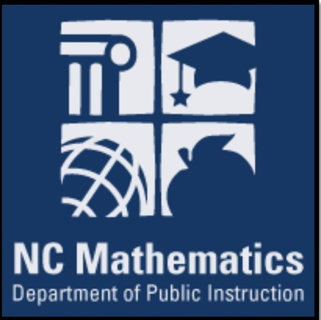

# **North Carolina Standard Course of Study K-8 Mathematics**

**for Implementation in 2018-2019 Adopted June 2017**

## **Kindergarten**

|  |  | Standards for Mathematical Practice |  |
| --- | --- | --- | --- |
| 1. | Make sense of problems and persevere in solving them. | 5. | Use appropriate tools strategically. |
| 2. | Reason abstractly and quantitatively. | 6. | Attend to precision. |
| 3. | Construct viable arguments and critique the reasoning of others. | 7. | Look for and make use of structure. |
| 4. | Model with mathematics. | 8. | Look for and express regularity in repeated reasoning. |

|  | Counting and Cardinality |
| --- | --- |
| Abbreviation | Standard |
| Know number names and the counting sequence. |  |
| NC.K.CC.1 | Know number names and recognize patterns in the counting sequence by: |
| • Counting to 100 by ones. |  |
| • Counting to 100 by tens. |  |
| NC.K.CC.2 | Count forward beginning from a given number within the known sequence, instead of having to begin at 1. |
| NC.K.CC.3 | Write numbers from 0 to 20. Represent a number of objects with a written numeral 0-20, with 0 representing a count of no |
| objects. |  |
| Count to tell the number of objects. |  |
| NC.K.CC.4 Understand the relationship between numbers and quantities. |  |
| • | When counting objects, say the number names in the standard order, pairing each object with one and only one number |
| name and each number name with one and only one object (one-to-one correspondence). |  |
| • | Recognize that the last number named tells the number of objects counted regardless of their arrangement (cardinality). |
| • | State the number of objects in a group, of up to 5 objects, without counting the objects (perceptual subitizing). |
| NC.K.CC.5 Count to answer "How many?" in the following situations: |  |
| • | Given a number from 1–20, count out that many objects. |
| • | Given up to 20 objects, name the next successive number when an object is added, recognizing the quantity is one |
| more/greater. |  |
| • | Given 20 objects arranged in a line, a rectangular array, and a circle, identify how many. |
| • | Given 10 objects in a scattered arrangement, identify how many. |
| Compare numbers. |  |
| NC.K.CC.6 | Identify whether the number of objects, within 10, in one group is greater than, less than, or equal to the number of objects in |
| another group, by using matching and counting strategies. |  |
| NC.K.CC.7 | Compare two numbers, within 10, presented as written numerals. |

Kindergarten - 2

|  | Operations and Algebraic Thinking |
| --- | --- |
| Abbreviation | Standard |
| Understand addition and | subtraction. |
| NC.K.OA.1 | Represent addition and subtraction, within 10: |
|  | • Use a variety of representations such as objects, fingers, mental images, drawings, sounds, acting out situations, verbal |
|  | explanations, or expressions. |
|  | • Demonstrate understanding of addition and subtraction by making connections among representations. |
| NC.K.OA.2 | Solve addition and subtraction word problems, within 10, using objects or drawings to represent the problem, when solving: |
|  | • Add to/Take From-Result Unknown |
|  | • Put Together/ Take Apart (Total Unknown and Two Addends Unknown) |
| NC.K.OA.3 | Decompose numbers less than or equal to 10 into pairs in more than one way using objects or drawings, and record each |
|  | decomposition by a drawing or expression. |
| NC.K.OA.4 | For any number from 0 to 10, find the number that makes 10 when added to the given number using objects or drawings, and |
|  | record the answer with a drawing or expression. |
| NC.K.OA.6 | Recognize and combine groups with totals up to 5 (conceptual subitizing). |
| NC.K.OA.5 | Demonstrate fluency with addition and subtraction within 5. |

|  | Number and Operations in Base Ten |
| --- | --- |
| Abbreviation | Standard |
| Build foundation for place value. |  |
| NC.K.NBT.1 | Compose and decompose numbers from 11 to 19 into ten ones and some further ones by: |
| Using objects or drawings. | • |
| Recording each composition or decomposition by a drawing or expression. | • |
| Understanding that these numbers are composed of ten ones and one, two, three, four, five, six, seven, eight, or nine | • |
| ones. |  |

| Measurement and Data |  |
| --- | --- |
| Abbreviation | Standard |
| Describe and compare measurable attributes. |  |
| NC.K.MD.1 Describe measurable attributes of objects; and describe several different measurable attributes of a single object. |  |
| NC.K.MD.2 Directly compare two objects with a measurable attribute in and describe the difference. | common, to see which object has "more of"/"less of" the attribute, |
| Classify objects and count the number of objects in each category. |  |
| NC.K.MD.3 | Classify objects into given categories; count the numbers of objects in each category and sort the categories by count. |

Kindergarten - 3

|  | Geometry |
| --- | --- |
| Abbreviation | Standard |
| Identify and describe shapes. |  |
| NC.K.G.1 | Describe objects in the environment using names of shapes, and describe the relative positions of objects using positional terms. |
| NC.K.G.2 | Correctly name squares, circles, triangles, rectangles, hexagons, cubes, cones, cylinders, and spheres regardless of their |
| orientations or overall size. |  |
| NC.K.G.3 | Identify squares, circles, triangles, rectangles, hexagons, cubes, cones, cylinders, and spheres as two-dimensional or three |
| dimensional. |  |
| Analyze, compare, create, and compose shapes. |  |
| NC.K.G.4 Analyze and compare two- | and three-dimensional shapes, in different sizes and orientations, using informal language to |
| describe their similarities, differences, attributes and other properties. |  |
| NC.K.G.5 Model shapes in the world by: |  |
| • | Building and drawing triangles, rectangles, squares, hexagons, circles. |
| Building cubes, cones, spheres, and cylinders. • |  |
| NC.K.G.6 | Compose larger shapes from simple shapes. |

## **First Grade**

|  |  | Standards for Mathematical Practice |  |
| --- | --- | --- | --- |
| 1. | Make sense of problems and persevere in solving them. | 5. | Use appropriate tools strategically. |
| 2. | Reason abstractly and quantitatively. | 6. | Attend to precision. |
| 3. | Construct viable arguments and critique the reasoning of others. | 7. | Look for and make use of structure. |
| 4. | Model with mathematics. | 8. | Look for and express regularity in repeated reasoning. |

| Operations and Algebraic Thinking |
| --- |
| Abbreviation Standard |
| Represent and solve problems. |
| NC.1.OA.1 Represent and solve addition and subtraction word problems, within 20, with unknowns, by using objects, drawings, and |
| equations with a symbol for the unknown number to represent the problem, when solving: |
| • Add to/Take from-Change Unknown |
| • Put together/Take Apart-Addend Unknown |
| • Compare-Difference Unknown |
| NC.1.OA.2 Represent and solve word problems that call for addition of three whole numbers whose sum is less than or equal to 20, by |
| using objects, drawings, and equations with a symbol for the unknown number. |
| Understand and apply the properties of operations. |
| NC.1.OA.3 Apply the commutative and associative properties as strategies for solving addition problems. |
| NC.1.OA.4 Solve an unknown-addend problem, within 20, by using addition strategies and/or changing it to a subtraction problem. |
| Add and subtract within 20. |
| NC.1.OA.9 Demonstrate fluency with addition and subtraction within 10. |
| NC.1.OA.6 Add and subtract, within 20, using strategies such as: |
| • Counting on |
| • Making ten |
| • Decomposing a number leading to a ten |
| • Using the relationship between addition and subtraction |
| • Using a number line |
| • Creating equivalent but simpler or known sums |
| Analyze addition and subtraction equations within 20. |
| NC.1.OA.7 Apply understanding of the equal sign to determine if equations involving addition and subtraction are true. |
| NC.1.OA.8 Determine the unknown whole number in an addition or subtraction equation involving three whole numbers. |

First Grade - 2

| Number and Operations in Base Ten |  |
| --- | --- |
| Abbreviation Standard |  |
| Extend and recognize patterns in the counting sequence. |  |
| NC.1.NBT.1 Count to 150, starting at any number less than 150. |  |
| NC.1.NBT.7 Read and write numerals, and represent a number of objects with a written numeral, to 100. |  |
| Understand place value. |  |
| NC.1.NBT.2 Understand that the two digits of a two-digit number represent amounts of | tens and ones. |
| • Unitize by making a ten from a collection of ten ones. |  |
| • Model the numbers from 11 to 19 as composed of a ten and one, two, three, four, five, six, seven, eight, or nine ones. |  |
| Demonstrate that the numbers 10, 20, 30, 40, 50, 60, 70, 80, 90 refer to one, two, three, four, five, six, seven, eight, or • |  |
| nine tens, with 0 ones. |  |
| NC.1.NBT.3 Compare two two-digit numbers based on the value of the tens and ones digits, recording the results of comparisons with the |  |
| symbols >, =, and <. |  |
| Use place value understanding and properties of operations. |  |
| NC.1.NBT.4 Using concrete models or drawings, strategies based on place value, properties of operations, and explaining the reasoning |  |
| used, add, within 100, in the following situations: |  |
| A two-digit number and a one-digit number • |  |
| • A two-digit number and a multiple of 10 |  |
| NC.1.NBT.5 Given a two-digit number, mentally find 10 more or 10 less than the number, without having to count; explain the reasoning |  |
| used. |  |
| NC.1.NBT.6 Subtract multiples of 10 in the range 10-90 from multiples of 10 in the range 10-90, explaining the reasoning, using: |  |
| Concrete models and drawings | • |
| Number lines | • |
| Strategies based on place value | • |
| Properties of operations | • |
| The relationship between addition and subtraction | • |

|
|  |

| Measurement and Data |  |
| --- | --- |
| Abbreviation Standard |  |
| Measure lengths. |  |
| NC.1.MD.1 Order three objects by length; compare the lengths of two objects indirectly by using a third object. |  |
| NC.1.MD.2 Measure lengths with non-standard units. |  |
| • Express the length of an object as a whole number of non-standard length units. |  |
| • Measure by laying multiple copies of a shorter object (the length unit) end to end (iterating) with no gaps or overlaps. |  |
| Build understanding of time and money. |  |
| NC.1.MD.3 Tell and write time in hours and half-hours using analog and digital clocks. |  |
| NC.1.MD.5 Identify quarters, dimes, and nickels and relate their values to pennies. |  |
| Represent and interpret data. |  |
| NC.1.MD.4 Organize, represent, and interpret data with up to three categories. |  |
| Ask and answer questions about the total number of data points. | • |
| Ask and answer questions about how many in each category. | • |
| Ask and answer questions about how many more or less are in one category than in another. | • |

|  | Geometry |
| --- | --- |
| Abbreviation | Standard |
| Reason with shapes and their attributes. |  |
| NC.1.G.1 | Distinguish between defining and non-defining attributes and create shapes with defining attributes by: |
|  | Building and drawing triangles, rectangles, squares, trapezoids, hexagons, circles. • |
|  | • Building cubes, rectangular prisms, cones, spheres, and cylinders. |
| NC.1.G.2 | Create composite shapes by: |
|  | • Making a two-dimensional composite shape using rectangles, squares, trapezoids, triangles, and half-circles naming the |
|  | components of the new shape. |
|  | Making a three-dimensional composite shape using cubes, rectangular prisms, cones, and cylinders, naming the • |
|  | components of the new shape. |
| NC.1.G.3 | Partition circles and rectangles into two and four equal shares. |
|  | • Describe the shares as halves and fourths, as half of and fourth of. |
|  | • Describe the whole as two of, or four of the shares. |
|  | Explain that decomposing into more equal shares creates smaller shares. • |

#### **Second Grade**

|  |  | Standards for Mathematical Practice |  |
| --- | --- | --- | --- |
| 1. | Make sense of problems and persevere in solving them. | 5. | Use appropriate tools strategically. |
| 2. | Reason abstractly and quantitatively. | 6. | Attend to precision. |
| 3. | Construct viable arguments and critique the reasoning of others. | 7. | Look for and make use of structure. |
| 4. | Model with mathematics. | 8. | Look for and express regularity in repeated reasoning. |

|  | Operations and Algebraic Thinking |
| --- | --- |
| Abbreviation | Standard |
| Represent and solve problems. |  |
| NC.2.OA.1 | Represent and solve addition and subtraction word problems, within 100, with unknowns in all positions, by using |
| representations and equations with a symbol for the unknown number to represent the problem, when solving: |  |
| • One-Step problems: |  |
| o Add to/Take from-Start Unknown |  |
| Compare-Bigger Unknown o |  |
| Compare-Smaller Unknown o |  |
| • Two-Step problems involving single digits: |  |
| o Add to/Take from- Change Unknown |  |
| Add to/Take From- Result Unknown o |  |
| Add and subtract within 20. |  |
| NC.2.OA.2 | Demonstrate fluency with addition and subtraction, within 20, using mental strategies. |
| Work with equal groups. |  |
| NC.2.OA.3 | Determine whether a group of objects, within 20, has an odd or even number of members by: |
| • Pairing objects, then counting them by 2s. |  |
| • Determining whether objects can be placed into two equal groups. |  |
| • Writing an equation to express an even number as | a sum of two equal addends. |
| NC.2.OA.4 | Use addition to find the total number of objects arranged in rectangular arrays with up to 5 rows and up to 5 columns; write an |
| equation to express the total as a sum of equal addends. |  |

|  | Number and Operations in Base Ten |
| --- | --- |
| Abbreviation | Standard |
| Understand place value. |  |
| NC.2.NBT.1 | Understand that the three digits of a three-digit number represent amounts of hundreds, tens, and ones. |
|  | • Unitize by making a hundred from a collection of ten tens. |
|  | • Demonstrate that the numbers 100, 200, 300, 400, 500, 600, 700, 800, 900 refer to one, two, three, four, five, six, seven, |
|  | eight, or nine hundreds, with 0 tens and 0 ones. |
|  | • Compose and decompose numbers using various groupings of hundreds, tens, and ones. |
| NC.2.NBT.2 | Count within 1,000; skip-count by 5s, 10s, and 100s. |
| NC.2.NBT.3 | Read and write numbers, within 1,000, using base-ten numerals, number names, and expanded form. |
| NC.2.NBT.4 | Compare two three-digit numbers based on the value of the hundreds, tens, and ones digits, using >, =, and < symbols to record |
|  | the results of comparisons. |
|  | Use place value understanding and properties of operations. |
| NC.2.NBT.5 | Demonstrate fluency with addition and subtraction, within 100, by: |
|  | • Flexibly using strategies based on place value, properties of operations, and/or the relationship between addition and |
|  | subtraction. |
|  | • Comparing addition and subtraction strategies, and explaining why they work. |
|  | • Selecting an appropriate strategy in order to efficiently compute sums and differences. |
| NC.2.NBT.6 | Add up to three two-digit numbers using strategies based on place value and properties of operations. |
| NC.2.NBT.7 | Add and subtract, within 1,000, relating the strategy to a written method, using: |
|  | • Concrete models or drawings |
|  | • Strategies based on place value |
|  | • Properties of operations |
|  | • Relationship between addition and subtraction |
| NC.2.NBT.8 | Mentally add 10 or 100 to a given number 100–900, and mentally subtract 10 or 100 from a given number 100–900. |

|  | Measurement and Data |
| --- | --- |
| Abbreviation | Standard |
| Measure and estimate lengths. |  |
| NC.2.MD.1 | Measure the length of an object in standard units by selecting and using appropriate tools such as rulers, yardsticks, meter |
| sticks, and measuring tapes. |  |
| NC.2.MD.2 | Measure the length of an object twice, using length units of different lengths for the two measurements; describe how the two |
| measurements relate to the size of the unit chosen. |  |
| NC.2.MD.3 | Estimate lengths in using standard units of inches, feet, yards, centimeters, and meters. |
| NC.2.MD.4 | Measure to determine how much longer one object is than another, expressing the length difference in terms of a standard |
| length unit. |  |
| Relate addition and subtraction to length. |  |
| NC.2.MD.5 | Use addition and subtraction, within 100, to solve word problems involving lengths that are given in the same units, using |
| equations with a symbol for the unknown number to represent the problem. |  |
| NC.2.MD.6 | Represent whole numbers as lengths from 0 on a number line diagram with equally spaced points and represent whole-number |
| sums and differences, within 100, on a number line. |  |
| Build understanding of time and money. |  |
| NC.2.MD.7 | Tell and write time from analog and digital clocks to the nearest five minutes, using a.m. and p.m. |
| NC.2.MD.8 Solve word problems involving: |  |
| • | Quarters, dimes, nickels, and pennies within 99¢, using ¢ symbols appropriately. |
| • Whole dollar amounts, using the $ symbol appropriately. |  |
| Represent and interpret data. |  |
| NC.2.MD.10 Organize, represent, and interpret data with up to four categories. |  |
| Draw a picture graph and a bar graph with a single-unit scale to represent a data set. | • |
| Solve simple put-together, take-apart, and compare problems using information presented in a picture and a bar graph. | • |

|  | Geometry |
| --- | --- |
| Abbreviation | Standard |
| Reason with shapes and their attributes. |  |
| NC.2.G.1 | Recognize and draw triangles, quadrilaterals, pentagons, and hexagons, having specified attributes; recognize and describe |
| attributes of rectangular prisms and cubes. |  |
| NC.2.G.3 | Partition circles and rectangles into two, three, or four equal shares. |
| • | Describe the shares using the words halves, thirds, half of, a third of, fourths, fourth of, quarter of. |
| • | Describe the whole as two halves, three thirds, four fourths. |
| • | Explain that equal shares of identical wholes need not have the same shape. |

# **Third Grade**

|  | Standards for Mathematical Practice |  |  |
| --- | --- | --- | --- |
| 1. | Make sense of problems and persevere in solving them. | 5. | Use appropriate tools strategically. |
| 2. | Reason abstractly and quantitatively. | 6. | Attend to precision. |
| 3. | Construct viable arguments and critique the reasoning of others. | 7. | Look for and make use of structure. |
| 4. | Model with mathematics. | 8. | Look for and express regularity in repeated reasoning. |

| Operations and Algebraic Thinking |  |
| --- | --- |
| Abbreviation | Standard |
| Represent and solve problems involving multiplication and division. |  |
| NC.3.OA.1 For products of whole numbers with two factors up to and including 10: |  |
| • | Interpret the factors as representing the number of equal groups and the number of objects in each group. |
| • | Illustrate and explain strategies including arrays, repeated addition, decomposing a factor, and applying the commutative |
| and associative properties. |  |
| NC.3.OA.2 | For whole-number quotients of whole numbers with a one-digit divisor and a one-digit quotient: |
| • | Interpret the divisor and quotient in a division equation as representing the number of equal groups and the number of |
| objects in each group. |  |
| • | Illustrate and explain strategies including arrays, repeated addition or subtraction, and decomposing a factor. |
| NC.3.OA.3 Represent, interpret, and solve one-step problems involving multiplication and division. |  |
| • | Solve multiplication word problems with factors up to and including 10. Represent the problem using arrays, pictures, |
| and/or equations with a symbol for the unknown number to represent the problem. |  |
| • | Solve division word problems with a divisor and quotient up to and including 10. Represent the problem using arrays, |
| pictures, repeated subtraction and/or equations with a symbol for the unknown number to represent the problem. |  |
| Understand properties of multiplication and the relationship between multiplication and division. |  |
| NC.3.OA.6 | Solve an unknown-factor problem, by using division strategies and/or changing it to a multiplication problem. |
| Multiply and divide within 100. |  |
| NC.3.OA.7 | Demonstrate fluency with multiplication and division with factors, quotients and divisors up to and including 10. |
| • Know from memory all products with factors up to and including 10. |  |
| • | Illustrate and explain using the relationship between multiplication and division. |
| • | Determine the unknown whole number in a multiplication or division equation relating three whole numbers. |
| Solve two-step problems. |  |
| NC.3.OA.8 | Solve two-step word problems using addition, subtraction, and multiplication, representing problems using equations with a |
| symbol for the unknown number. |  |
| Explore patterns of numbers. |  |
| NC.3.OA.9 Interpret patterns of multiplication on a hundreds board and/or multiplication table. |  |

Third Grade - 2

| Number and Operations in Base Ten |
| --- |
| Abbreviation Standard |
| Use place value to add and subtract. |
| NC.3.NBT.2 Add and subtract whole numbers up to and including 1,000. |
| • Use estimation strategies to assess reasonableness of answers. |
| • Model and explain how the relationship between addition and subtraction can be applied to solve addition and subtraction |
| problems. |
| • Use expanded form to decompose numbers and then find sums and differences. |
| Generalize place value understanding for multi-digit numbers. |
| NC.3.NBT.3 Use concrete and pictorial models, based on place value and the properties of operations, to find the product of a one-digit |
| whole number by a multiple of 10 in the range 10–90. |

|  | Number and Operations – Fractions |
| --- | --- |
| Abbreviation | Standard |
| Understand fractions as numbers. |  |
| NC.3.NF.1 | Interpret unit fractions with denominators of 2, 3, 4, 6, and 8 as quantities formed when a whole is partitioned into equal parts; |
| • Explain that a unit fraction is one of those parts. |  |
| • | Represent and identify unit fractions using area and length models. |
| NC.3.NF.2 | Interpret fractions with denominators of 2, 3, 4, 6, and 8 using area and length models. |
| • | Using an area model, explain that the numerator of a fraction represents the number of equal parts of the unit fraction. |
| • | Using a number line, explain that the numerator of a fraction represents the number of lengths of the unit fraction from 0. |
| NC.3.NF.3 Represent equivalent fractions with area and length models by: |  |
| • | Composing and decomposing fractions into equivalent fractions using related fractions: halves, fourths and eighths; thirds |
| and sixths. |  |
| • | Explaining that a fraction with the same numerator and denominator equals one whole. |
| • | Expressing whole numbers as fractions, and recognize fractions that are equivalent to whole numbers. |
| NC.3.NF.4 | Compare two fractions with the same numerator or the same denominator by reasoning about their size, using area and length |
| models, and using the >, <, and = symbols. Recognize that comparisons are valid only when the two fractions refer to the same |  |
| whole with denominators: halves, fourths and eighths; thirds and sixths. |  |

|
|  |

| Measurement and Data |  |
| --- | --- |
| Abbreviation Standard |  |
| Solve problems involving measurement. |  |
| NC.3.MD.1 Tell and write time to the nearest minute. Solve word problems involving addition and subtraction of time intervals within the |  |
| same hour. |  |
| NC.3.MD.2 Solve problems involving customary measurement. |  |
| • Estimate and measure lengths in customary units to the quarter-inch and half-inch, and feet and yards to the whole unit. |  |
| • Estimate and measure capacity and weight in customary units to a whole number: cups, pints, quarts, gallons, ounces, |  |
| and pounds. |  |
| • Add, subtract, multiply, or divide to solve one-step word problems involving whole number measurements of length, |  |
| weight, and capacity in the same customary units. |  |
| Represent and interpret data. |  |
| NC.3.MD.3 Represent and interpret scaled picture and bar graphs: |  |
| • Collect data by asking a question that yields data in up to four categories. |  |
| • | Make a representation of data and interpret data in a frequency table, scaled picture graph, and/or scaled bar graph with |
| axes provided. |  |
| • Solve one and two-step "how many more" and "how many less" problems using information from these | graphs |
| Understand the concept of area. |  |
| NC.3.MD.5 Find the area of a rectangle with whole-number side lengths by tiling without gaps or overlaps and counting unit squares. |  |
| NC.3.MD.7 Relate area to the operations of multiplication and addition. |  |
| • Find the area of a rectangle with whole-number side lengths by tiling it, and show that the area is the same as would be |  |
| found by multiplying the side lengths. |  |
| • Multiply side lengths to find areas of rectangles with whole-number side lengths in the context of solving problems, and |  |
| represent whole-number products as rectangular areas in mathematical reasoning. |  |
| • Use tiles and/or arrays to illustrate and explain that the area of a rectangle can be found by partitioning it into two smaller |  |
| rectangles, and that the area of the large rectangle is the sum of the two smaller rectangles. |  |
| Understand the concept of perimeter. |  |
| NC.3.MD.8 Solve problems involving perimeters of polygons, including finding the perimeter given the side lengths, and finding an unknown |  |
| side length. |  |

|  | Geometry |
| --- | --- |
| Abbreviation | Standard |
| Reason with shapes and their attributes. |  |
| NC.3.G.1 Reason with two-dimensional shapes and their attributes. |  |
| Investigate, describe, and reason about composing triangles and quadrilaterals and decomposing quadrilaterals. | • |
| Recognize and draw examples and non-examples of types of quadrilaterals including rhombuses, rectangles, squares, | • |
| parallelograms, and trapezoids. |  |

#### **Fourth Grade**

|  |  | Standards for Mathematical Practice |  |
| --- | --- | --- | --- |
| 1. | Make sense of problems and persevere in solving them. | 5. | Use appropriate tools strategically. |
| 2. | Reason abstractly and quantitatively. | 6. | Attend to precision. |
| 3. | Construct viable arguments and critique the reasoning of others. | 7. | Look for and make use of structure. |
| 4. | Model with mathematics. | 8. | Look for and express regularity in repeated reasoning. |

| Operations and Algebraic Thinking |  |
| --- | --- |
| Abbreviation | Standard |
| Represent and solve problems involving multiplication and division. |  |
| NC.4.OA.1 | Interpret a multiplication equation as a comparison. Multiply or divide to solve word problems involving multiplicative |
| comparisons using models and equations with a symbol for the unknown number. Distinguish multiplicative comparison from |  |
| additive comparison. |  |
| Use the four operations with whole numbers to solve problems. |  |
| NC.4.OA.3 Solve two-step word problems involving the four operations with whole numbers. |  |
| • Use estimation strategies to assess reasonableness of answers. |  |
| • Interpret remainders in word problems. |  |
| • Represent problems using equations with a letter standing for the unknown quantity. |  |
| Gain familiarity with factors and multiples. |  |
| NC.4.OA.4 Find all factor pairs for whole numbers up to and including 50 to: |  |
| • Recognize that a whole number is a multiple of each of its factors. |  |
| • Determine whether a given whole number is a multiple of a given one-digit number. |  |
| • Determine if the number is prime or composite. |  |
| Generate and analyze patterns. |  |
| NC.4.OA.5 Generate and analyze a number or shape pattern that follows a given rule. |  |

| Number and Operations in Base Ten |
| --- |
| Abbreviation Standard |
| Generalize place value understanding for multi-digit whole numbers. |
| NC.4.NBT.1 Explain that in a multi-digit whole number, a digit in one place represents 10 times as much as it represents in the place to its |
| right, up to 100,000. |
| NC.4.NBT.2 Read and write multi-digit whole numbers up to and including 100,000 using numerals, number names, and expanded form. |
| NC.4.NBT.7 Compare two multi-digit numbers up to and including 100,000 based on the values of the digits in each place, using >, =, and < |
| symbols to record the results of comparisons. |
| Use place value understanding and properties of operations to perform multi-digit arithmetic. |
| NC.4.NBT.4 Add and subtract multi-digit whole numbers up to and including 100,000 using the standard algorithm with place value |
| understanding. |
| NC.4.NBT.5 Multiply a whole number of up to three digits by a one-digit whole number, and multiply up to two two-digit numbers with place |
| value understanding using area models, partial products, and the properties of operations. Use models to make connections |
| and develop the algorithm. |
| NC.4.NBT.6 Find whole-number quotients and remainders with up to three-digit dividends and one-digit divisors with place value |
| understanding using rectangular arrays, area models, repeated subtraction, partial quotients, properties of operations, and/or |
| the relationship between multiplication and division. |

| Number and Operations – | Fractions |
| --- | --- |
| Abbreviation | Standard |
| Extend understanding of fractions. |  |
| NC.4.NF.1 Explain why a fraction is equivalent to another fraction by using area and length fraction models, with attention to how the |  |
| number and size of the parts differ even though the two fractions themselves are the same size. |  |
| NC.4.NF.2 | Compare two fractions with different numerators and different denominators, using the denominators 2, 3, 4, 5, 6, 8, 10, 12, and |
| 100. Recognize that comparisons are valid only when the two fractions refer to the same whole. Record the results of |  |
| comparisons with symbols >, =, or <, and justify the conclusions by: |  |
| • Reasoning about their size and using area and length models. |  |
| • Using benchmark fractions 0, ½, and a whole. |  |
| • Comparing common numerator or common denominators. |  |
| Build fractions from unit fractions by applying and extending previous understandings of operations on whole numbers. |  |
| NC.4.NF.3 Understand and justify decompositions of fractions with denominators of 2, 3, 4, 5, 6, 8, 10, 12, and 100. |  |
| • Understand addition and subtraction of fractions as joining and separating parts referring to the same whole. |  |
| • | Decompose a fraction into a sum of unit fractions and a sum of fractions with the same denominator in more than one |
| way using area models, length models, and equations. |  |
| • | Add and subtract fractions, including mixed numbers with like denominators, by replacing each mixed number with an |
| equivalent fraction, and/or by using properties of operations and the relationship between addition and subtraction. |  |
| • | Solve word problems involving addition and subtraction of fractions, including mixed numbers by writing equations from a |
| visual representation of the problem. |  |
| Use unit fractions to understand operations of fractions. |  |
| NC.4.NF.4 Apply and extend previous understandings of multiplication to: |  |
| • | Model and explain how fractions can be represented by multiplying a whole number by a unit fraction, using this |
| understanding to multiply a whole number by any fraction less than one. |  |
| • Solve word problems involving multiplication of a fraction by a whole number. |  |
| Understand decimal notation for fractions, and compare decimal fractions. |  |
| NC.4.NF.6 Use decimal notation to represent fractions. |  |
| • Express, model and explain the equivalence between fractions with denominators of 10 and 100. |  |
| • Use equivalent fractions to add two fractions with denominators of 10 or 100. |  |
| • Represent tenths and hundredths with models, making connections between fractions and decimals. |  |
| NC.4.NF.7 Compare two decimals to hundredths by reasoning about their size using | area and length models, and recording the results of |
| comparisons with the symbols >, =, or <. Recognize that comparisons are valid only when the two decimals refer to the same |  |
| whole. |  |

| Measurement and Data |  |
| --- | --- |
| Abbreviation | Standard |
| Solve problems involving measurement. |  |
| NC.4.MD.1 Know relative sizes of measurement units. Solve problems involving metric measurement. |  |
| • Measure to solve problems involving metric units: | centimeter, meter, gram, kilogram, Liter, milliliter. |
| • | Add, subtract, multiply, and divide to solve one-step word problems involving whole-number measurements of length, |
| mass, and capacity that are given in metric units. |  |
| NC.4.MD.2 Use multiplicative reasoning to convert metric measurements from a larger unit to a smaller unit using place value |  |
| understanding, two-column tables, and length models. |  |
| NC.4.MD.8 Solve word problems involving addition and subtraction of time intervals that cross the hour. |  |
| Solve problems involving area and perimeter. |  |
| NC.4.MD.3 Solve problems with area and perimeter. |  |
| • Find areas of rectilinear figures with known side lengths. |  |
| • Solve problems involving a fixed area and varying perimeters and a fixed perimeter and varying areas. |  |
| • Apply the area and perimeter formulas for rectangles | in real world and mathematical problems. |
| Represent and interpret data. |  |
| NC.4.MD.4 Represent and interpret data using whole numbers. |  |
| • Collect data by asking a question that yields numerical data. |  |
| • Make a representation of data and interpret data in a frequency table, scaled bar graph, and/or line plot. |  |
| • Determine whether a survey question will yield categorical or numerical data. |  |
| Understand concepts of angle and measure angles. |  |
| NC.4.MD.6 Develop an understanding of angles and angle measurement. |  |
| • | Understand angles as geometric shapes that are formed wherever two rays share a common endpoint, and are |
| measured in degrees. |  |
| • | Measure and sketch angles in whole-number degrees using a protractor. |
| • | Solve addition and subtraction problems to find unknown angles on a diagram in real-world and mathematical problems. |

|  | Geometry |
| --- | --- |
| Abbreviation | Standard |
|  | Classify shapes based on lines and angles in two-dimensional figures. |
| NC.4.G.1 | Draw and identify points, lines, line segments, rays, angles, and perpendicular and parallel lines. |
| NC.4.G.2 | Classify quadrilaterals and triangles based on angle measure, side lengths, and the presence or absence of parallel or perpendicular lines. |
| NC.4.G.3 | Recognize symmetry in a two-dimensional figure, and identify and draw lines of symmetry. |

# **Fifth Grade**

|  |  | Standards for Mathematical Practice |  |
| --- | --- | --- | --- |
| 1. | Make sense of problems and persevere in solving them. | 5. | Use appropriate tools strategically. |
| 2. | Reason abstractly and quantitatively. | 6. | Attend to precision. |
| 3. | Construct viable arguments and critique the reasoning of others. | 7. | Look for and make use of structure. |
| 4. | Model with mathematics. | 8. | Look for and express regularity in repeated reasoning. |

|  |  | Operations and Algebraic Thinking |
| --- | --- | --- |
| Abbreviation |  | Standard |
| Write and interpret numerical expressions. |  |  |
| NC.5.OA.2 |  | Write, explain, and evaluate numerical expressions involving the four operations to solve up to two-step problems. Include |
| expressions involving: |  |  |
| Parentheses, using the order of operations. | • |  |
| • | Commutative, associative and distributive properties. |  |
| Analyze patterns and relationships. |  |  |
| NC.5.OA.3 Generate two numerical patterns using two given rules. |  |  |
| • |  | Identify apparent relationships between corresponding terms. |
| • |  | Form ordered pairs consisting of corresponding terms from the two patterns. |
| • | Graph the ordered pairs on a coordinate plane. |  |

|  | Number and Operations in Base Ten |
| --- | --- |
| Abbreviation | Standard |
| Understand the place value system. |  |
| NC.5.NBT.1 | Explain the patterns in the place value system from one million to the thousandths place. |
| • | Explain that in a multi-digit number, a digit in one place represents 10 times as much as it represents in the place to its |
| right and 1/10 of what it represents in the place to its left. |  |
| • | Explain patterns in products and quotients when numbers are multiplied by 1,000, 100, 10, 0.1, and 0.01 and/or divided |
| by 10 and 100. |  |
| NC.5.NBT.3 Read, write, and compare decimals to thousandths. |  |
| • | Write decimals using base-ten numerals, number names, and expanded form. |
| • | Compare two decimals to thousandths based on the value of the digits in each place, using >, =, and < symbols to record |
| the results of comparisons. |  |
| Perform operations with multi-digit whole numbers. |  |
| NC.5.NBT.5 | Demonstrate fluency with the multiplication of two whole numbers up to a three-digit number by a two-digit number using the |
| standard algorithm. |  |
| NC.5.NBT.6 | Find quotients with remainders when dividing whole numbers with up to four-digit dividends and two-digit divisors using |
| rectangular arrays, area models, repeated subtraction, partial quotients, and/or the relationship between multiplication and |  |
| division. Use models to make connections and develop the algorithm. |  |
| Perform operations with decimals. |  |
| NC.5.NBT.7 | Compute and solve real-world problems with multi-digit whole numbers and decimal numbers. |
| • | Add and subtract decimals to thousandths using models, drawings or strategies based on place value. |
| • | Multiply decimals with a product to thousandths using models, drawings, or strategies based on place value. |
| • | Divide a whole number by a decimal and divide a decimal by a whole number, using repeated subtraction or area models. |
| Decimals should be limited to hundredths. |  |
| • | Use estimation strategies to assess reasonableness of answers. |

|  | Number and Operations – Fractions |
| --- | --- |
| Abbreviation | Standard |
| Use equivalent fractions as a strategy to add and subtract fractions. |  |
| NC.5.NF.1 | Add and subtract fractions, including mixed numbers, with unlike denominators using related fractions: halves, fourths and |
| eighths; thirds, sixths, and twelfths; fifths, tenths, and hundredths. |  |
| • | Use benchmark fractions and number sense of fractions to estimate mentally and assess the reasonableness of answers. |
| • Solve one- | and two-step word problems in context using area and length models to develop the algorithm. Represent the |
| word problem in an equation. |  |
| Apply and extend previous understandings of multiplication and division to multiply and divide fractions. |  |
| NC.5.NF.3 Use fractions to model and solve division problems. |  |
| • | Interpret a fraction as an equal sharing context, where a quantity is divided into equal parts. |
| • | Model and interpret a fraction as the division of the numerator by the denominator. |
| • | Solve one-step word problems involving division of whole numbers leading to answers in the form of fractions and mixed |
| numbers, with denominators of 2, 3, 4, 5, 6, 8, 10, and 12, | using area, length, and set models or equations. |
| NC.5.NF.4 | Apply and extend previous understandings of multiplication to multiply a fraction or whole number by a fraction, including mixed |
| numbers. |  |
| • | Use area and length models to multiply two fractions, with the denominators 2, 3, 4. |
| • | Explain why multiplying a given number by a fraction greater than 1 results in a product greater than the given number |
| and when multiplying a given number by a fraction less than 1 results in a product smaller than | the given number. |
| • | Solve one-step word problems involving multiplication of fractions using models to develop the algorithm. |
| NC.5.NF.7 | Solve one-step word problems involving division of unit fractions by non-zero whole numbers and division of whole numbers by |
| unit fractions using area and length models, and equations to represent the problem. |  |

Fifth Grade - 4

|  | Measurement and Data |
| --- | --- |
| Abbreviation | Standard |
| Convert like measurement units within a given measurement system. |  |
| NC.5.MD.1 | Given a conversion chart, use multiplicative reasoning to solve one-step conversion problems within a given measurement |
| system. |  |
| Represent and interpret data. |  |
| NC.5.MD.2 Represent and interpret data. |  |
| • | Collect data by asking a question that yields data that changes over time. |
| • Make and interpret a representation of data using a line graph. |  |
| • | Determine whether a survey question will yield categorical or numerical data, or data that changes over time. |
| Understand concepts of volume. |  |
| NC.5.MD.4 | Recognize volume as an attribute of solid figures and measure volume by counting unit cubes, using cubic centimeters, cubic |
| inches, cubic feet, and improvised units. |  |
| NC.5.MD.5 Relate volume to the operations of multiplication and addition. |  |
| • | Find the volume of a rectangular prism with whole-number side lengths by packing it with unit cubes, and show that the |
| volume is the same as would be found by multiplying the edge lengths. |  |
| • | Build understanding of the volume formula for rectangular prisms with whole-number edge lengths in the context of |
| solving problems. |  |
| • | Find volume of solid figures with one-digit dimensions composed of two non-overlapping rectangular prisms. |

|  | Geometry |
| --- | --- |
| Abbreviation | Standard |
| Understand the coordinate plane. |  |
| NC.5.G.1 | Graph points in the first quadrant of a coordinate plane, and identify and interpret the x and y coordinates to solve problems. |
| Classify quadrilaterals. |  |
| NC.5.G.3 | Classify quadrilaterals into categories based on their properties. |
| • | Explain that attributes belonging to a category of quadrilaterals also belong to all subcategories of that category. |
| • | Classify quadrilaterals in a hierarchy based on properties. |

| Standards for Mathematical Practice |  |
| --- | --- |
| 1. Make sense of problems and persevere in solving them. 5. Use appropriate tools strategically. |  |
| 2. Reason abstractly and quantitatively. 6. Attend to precision. |  |
| 3. Construct viable arguments and critique the reasoning of others. 7. Look for and make use of structure. |  |
| 4. Model with mathematics. 8. | Look for and express regularity in repeated reasoning. |
| Ratio and Proportional Relationships |  |
| Abbreviation Standard |  |
| Understand ratio concepts and use ratio reasoning to solve problems. |  |
| NC.6.RP.1 Understand the concept of a ratio and use ratio language to: |  |
| • Describe a ratio as a multiplicative relationship between two quantities. |  |
| • Model a ratio relationship using a variety of representations. |  |
| NC.6.RP.2 Understand that ratios can be expressed as equivalent unit ratios by finding and interpreting both unit ratios in context. |  |
| NC.6.RP.3 Use ratio reasoning with equivalent whole-number ratios to solve real-world and mathematical problems by: |  |
| • Creating and using a table to compare ratios. |  |
| • Finding missing values in the tables. |  |
| • Using a unit ratio. |  |
| • Converting and manipulating measurements using given ratios. |  |
| • Plotting the pairs of values on the coordinate plane. |  |
| NC.6.RP.4 Use ratio reasoning to solve real-world and mathematical problems with percents by: |  |

| • | Understanding and finding a percent of a quantity as a ratio per 100. |
| --- | --- |
| • | Using equivalent ratios, such as benchmark percents (50%, 25%, 10%, 5%, 1%), to determine a part of any given |
|  | quantity. |
| • | Finding the whole, given a part and the percent. |

| The Number System |  |
| --- | --- |
| Abbreviation Standard |  |
| Apply and extend previous understandings of multiplication and division to divide fractions by fractions. |  |
| NC.6.NS.1 Use visual models and common denominators to: |  |
| • Interpret and compute quotients of fractions. |  |
| • Solve real-world and mathematical problems involving division of fractions. |  |
| Compute fluently with multi-digit numbers and find common factors and multiples. |  |
| NC.6.NS.2 Fluently divide using long division with a minimum of a four-digit dividend and interpret the quotient and remainder in context. |  |
| NC.6.NS.3 Apply and extend previous understandings of decimals to develop and fluently use the standard algorithms for addition, |  |
| subtraction, multiplication and division of decimals. |  |
| NC.6.NS.4 Understand and use prime factorization and the relationships between factors to: |  |
| • Find the unique prime factorization for a whole number. |  |
| • Find the greatest common factor of two whole numbers less than or equal to 100. |  |
| • | Use the greatest common factor and the distributive property to rewrite the sum of two whole numbers, each less than or |
| equal to 100. |  |
| • | Find the least common multiple of two whole numbers less than or equal to 12 to add and subtract fractions with unlike |
| denominators. |  |
| Apply and extend previous understandings of numbers to the system of rational numbers. |  |
| NC.6.NS.5 Understand and use rational numbers to: |  |
| • Describe quantities having opposite directions or values. |  |
| • Represent quantities in real-world contexts, explaining the meaning of 0 in each situation. |  |
| • Understand the absolute value of a rational number as its distance from 0 on the number line to: |  |
| o Interpret absolute value as magnitude for a positive or negative quantity in a real-world context. |  |
| o Distinguish comparisons of absolute value from statements about order. |  |
| NC.6.NS.6 Understand rational numbers as points on the number line and as ordered pairs on a coordinate plane. |  |
| a. On a number line: |  |
| o | Recognize opposite signs of numbers as indicating locations on opposite sides of 0 and that the opposite of the |
| opposite of a number is the number itself. |  |
| o Find and position rational numbers on a horizontal or vertical number line. |  |
| b. On a coordinate plane: |  |
| Understand signs of numbers in ordered pairs as indicating locations in quadrants. o |  |
| o | Recognize that when two ordered pairs differ only by signs, the locations of the points are related by reflections |
| across one or both axes. |  |
| Find and position pairs of rational numbers on a coordinate plane. o |  |
| NC.6.NS.7 Understand ordering of rational numbers. |  |
| a. | Interpret statements of inequality as statements about the relative position of two numbers on a number line diagram. |
| b. Write, interpret, and explain statements of order for rational numbers in real-world contexts. |  |
| NC.6.NS.8 Solve real-world and mathematical problems by graphing points in all four quadrants of the coordinate plane. Include use of |  |
| coordinates and absolute value to find distances between points with the same first coordinate or the same second coordinate. |  |

|  | The Number System |
| --- | --- |
| Abbreviation | Standard |
| NC.6.NS.9 | Apply and extend previous understandings of addition and subtraction. |
|  | • Describe situations in which opposite quantities combine to make 0. |
|  | • Understand � + � as the number located a distance q from p, in the positive or negative direction depending on the sign |
|  | of q. Show that a number and its additive inverse create a zero pair. |
|  | • Understand subtraction of integers as adding the additive inverse, � − � = � + (– �). Show that the distance between two |
|  | integers on the number line is the absolute value of their difference. |
|  | • Use models to add and subtract integers from -20 to 20 and describe real-world contexts using sums and differences. |

| Expressions and Equations |  |
| --- | --- |
| Abbreviation Standard |  |
| Apply and extend previous understandings of arithmetic to algebraic expressions. |  |
| NC.6.EE.1 Write and evaluate numerical expressions, with and without grouping symbols, involving whole-number exponents. |  |
| NC.6.EE.2 Write, read, and evaluate algebraic expressions. |  |
| • Write expressions that record operations with numbers and with letters standing for numbers. |  |
| • Identify parts of an expression using mathematical terms and view one or more of those parts as a single entity. |  |
| • Evaluate expressions at specific values of their variables using expressions that arise from formulas used in real-world |  |
| problems. |  |
| NC.6.EE.3 Apply the properties of operations to generate equivalent expressions without exponents. |  |
| NC.6.EE.4 Identify when two expressions are equivalent and justify with mathematical reasoning. |  |
| Reason about and solve one-variable equations. |  |
| NC.6.EE.5 Use substitution to determine whether a given number in a specified set makes an equation true. |  |
| NC.6.EE.6 Use variables to represent numbers and write expressions when solving a real-world or mathematical problem. |  |
| NC.6.EE.7 Solve real-world and mathematical problems by writing and solving equations of the form: |  |
| • � + � = � in which �, � and � are all nonnegative rational numbers; and, |  |
| • � ∙ � = � for cases in which �, � and � are all nonnegative rational numbers. |  |
| Reason about one variable inequalities. |  |
| NC.6.EE.8 Reason about inequalities by: |  |
| • Using substitution to determine whether a given number in a specified set makes an inequality true. |  |
| • Writing an inequality of the form � > � or � < � | to represent a constraint or condition in a real-world or mathematical |
| problem. |  |
| • Recognizing that inequalities of the form � > � or � < � | have infinitely many solutions. |
| • Representing solutions of inequalities on number line diagrams. |  |
| Represent and analyze quantitative relationships between dependent and independent variables. |  |
| NC.6.EE.9 Represent and analyze quantitative relationships by: |  |
| • | Using variables to represent two quantities in a real-world or mathematical context that change in relationship to one |
| another. |  |
| • | Analyze the relationship between quantities in different representations (context, equations, tables, and graphs). |

|  | Geometry |
| --- | --- |
| Abbreviation | Standard |
| Solve real-world and mathematical problems involving area, surface area, and volume. |  |
| NC.6.G.1 Create geometric models to solve real-world and mathematical problems to: |  |
| • | Find the area of triangles by composing into rectangles and decomposing into right triangles. |
| • | Find the area of special quadrilaterals and polygons by decomposing into triangles or rectangles. |
| NC.6.G.2 | Apply and extend previous understandings of the volume of a right rectangular prism to find the volume of right rectangular |
| prisms with fractional edge lengths. Apply this understanding to the context of solving real-world and mathematical problems. |  |
| NC.6.G.3 Use the coordinate plane to solve real-world | and mathematical problems by: |
| • Drawing polygons in the coordinate plane given coordinates for the vertices. |  |
| • | Using coordinates to find the length of a side joining points with the same first coordinate or the same second coordinate. |
| NC.6.G.4 | Represent right prisms and right pyramids using nets made up of rectangles and triangles, and use the nets to find the surface |
| area of these figures. Apply these techniques in the context of solving real-world and mathematical problems. |  |

| Statistics and Probability |  |  |
| --- | --- | --- |
| Abbreviation |  | Standard |
| Develop understanding of statistical variability. |  |  |
| NC.6.SP.1 |  | Recognize a statistical question as one that anticipates variability in the data related to the question and accounts for it in the |
| answers. |  |  |
| NC.6.SP.2 |  | Understand that a set of data collected to answer a statistical question has a distribution which can be described by its center, |
| spread, and overall shape. |  |  |
| NC.6.SP.3 |  | Understand that both a measure of center and a description of variability should be considered when describing a numerical |
| data set. |  |  |
| a. |  | Determine the measure of center of a data set and understand that it is a single number that summarizes all the values |
| of that data set. |  |  |
| Understand that a mean is a measure of center that represents a balance point or fair share of a data set and can be | o |  |
| influenced by the presence of extreme values within the data set. |  |  |
| Understand the median as a measure of center that is the numerical middle of an ordered data set. | o |  |
| b. |  | Understand that describing the variability of a data set is needed to distinguish between data sets in the same scale, by |
| comparing graphical representations of different data sets in the same scale that have similar measures of center, but |  |  |
| different spreads. |  |  |
| Summarize and describe distributions. |  |  |
| Display numerical data in plots on a number line. | NC.6.SP.4 |  |
| • Use dot plots, histograms, and box plots to represent data. |  |  |
| • |  | Compare the attributes of different representations of the same data. |
| NC.6.SP.5 |  | Summarize numerical data sets in relation to their context. |
| a. |  | Describe the collected data by: |
| Reporting the number of observations in dot plots and histograms. | o |  |
| Communicating the nature of the attribute under investigation, how it was measured, and the units of measurement. | o |  |
| b. |  | Analyze center and variability by: |
| Giving quantitative measures of center, describing variability, and any overall pattern, and noting any striking | o |  |
| deviations. |  |  |
| Justifying the appropriate choice of measures of center using the shape of the data distribution. | o |  |

#### **Seventh Grade**

|  | Standards for Mathematical Practice |
| --- | --- |
| 1. Make sense of problems and persevere in solving them. | 5. Use appropriate tools strategically. |
| 2. | Reason abstractly and quantitatively. 6. Attend to precision. |
| 3. | Construct viable arguments and critique the reasoning of others. 7. Look for and make use of structure. |
| 4. | Model with mathematics. 8. Look for and express regularity in repeated reasoning. |
|  | Ratio and Proportional Relationships |
| Abbreviation | Standard |
|  | Analyze proportional relationships and use them to solve real-world and mathematical problems. |
| NC.7.RP.1 | Compute unit rates associated with ratios of fractions to solve real-world and mathematical problems. |
| NC.7.RP.2 | Recognize and represent proportional relationships between quantities. |
|  | a. Understand that a proportion is a relationship of equality between ratios. |
|  | o Represent proportional relationships using tables and graphs. |
|  | Recognize whether ratios are in a proportional relationship using tables and graphs. o |
|  | Compare two different proportional relationships using tables, graphs, equations, and verbal descriptions. o |
|  | b. Identify the unit rate (constant of proportionality) within two quantities in a proportional relationship using tables, graphs, |
|  | equations, and verbal descriptions. |

- c. Create equations and graphs to represent proportional relationships.

|
|  |

- o Explain the meaning of any point (, *)*.
	- o Explain the meaning of (0, 0) and why it is included.
- o Understand that the -coordinate of the ordered pair (1, ) corresponds to the unit rate and explain its meaning.
- **NC.7.RP.3** Use scale factors and unit rates in proportional relationships to solve ratio and percent problems.

Seventh Grade - 2

|  | The Number System |
| --- | --- |
| Abbreviation | Standard |
|  | Apply and extend previous understandings of operations with fractions to add, subtract, multiply, and divide rational numbers. |
| NC.7.NS.1 | Apply and extend previous understandings of addition and subtraction to add and subtract rational numbers, using the |
|  | properties of operations, and describing real-world contexts using sums and differences. |
| NC.7.NS.2 | Apply and extend previous understandings of multiplication and division. |
|  | a. Understand that a rational number is any number that can be written as a quotient of integers with a non-zero divisor. |
|  | b. Apply properties of operations as strategies, including the standard algorithms, to multiply and divide rational numbers |
|  | and describe the product and quotient in real-world contexts. |
|  | c. Use division and previous understandings of fractions and decimals. |
|  | o Convert a fraction to a decimal using long division. |
|  | o Understand that the decimal form of a rational number terminates in 0s or eventually repeats. |
| NC.7.NS.3 | Solve real-world and mathematical problems involving numerical expressions with rational numbers using the four operations. |

|  | Expressions and Equations |
| --- | --- |
| Abbreviation | Standard |
| Use properties of operations to generate equivalent expressions. |  |
| NC.7.EE.1 Apply properties of operations as strategies to: |  |
| • | Add, subtract, and expand linear expressions with rational coefficients. |
| • Factor linear expression with an integer GCF. |  |
| NC.7.EE.2 | Understand that equivalent expressions can reveal real-world and mathematical relationships. Interpret the meaning of the parts |
| of each expression in context. |  |
| Solve real-world and mathematical problems using numerical and algebraic expressions, equations, and inequalities. |  |
| NC.7.EE.3 | Solve multi-step real-world and mathematical problems posed with rational numbers in algebraic expressions. |
| • | Apply properties of operations to calculate with positive and negative numbers in any form. |
| • | Convert between different forms of a number and equivalent forms of the expression as appropriate. |
| NC.7.EE.4 | Use variables to represent quantities to solve real-world or mathematical problems. |
| a. | Construct equations to solve problems by reasoning about the quantities. |
| o | Fluently solve multistep equations with the variable on one side, including those generated by word problems. |
| o | Compare an algebraic solution to an arithmetic solution, identifying the sequence of the operations used in each |
| approach. |  |
| Interpret the solution in context. | o |
| b. | Construct inequalities to solve problems by reasoning about the quantities. |
| o | Fluently solve multi-step inequalities with the variable on one side, including those generated by word problems. |
| o | Compare an algebraic solution process for equations and an algebraic solution process for inequalities. |
| Graph the solution set of the inequality and interpret in context. | o |

Seventh Grade - 3

|  | Geometry |
| --- | --- |
| Abbreviation | Standard |
| Draw, construct, and describe geometrical figures and describe the relationships between them. |  |
| NC.7.G.1 | Solve problems involving scale drawings of geometric figures by: |
| • | Building an understanding that angle measures remain the same and side lengths are proportional. |
| • | Using a scale factor to compute actual lengths and areas from a scale drawing. |
| • Creating a scale drawing. |  |
| NC.7.G.2 | Understand the characteristics of angles and side lengths that create a unique triangle, more than one triangle or no triangle. |
| Build triangles from three measures of angles and/or sides. |  |
| Solve real-world and mathematical problems involving angle measure, area, surface area, and volume. |  |
| NC.7.G.4 Understand area and circumference of a circle. |  |
| • | Understand the relationships between the radius, diameter, circumference, and area. |
| • | Apply the formulas for area and circumference of a circle to solve problems. |
| NC.7.G.5 | Use facts about supplementary, complementary, vertical, and adjacent angles in a multi-step problem to write and solve |
| equations for an unknown angle in a figure. |  |
| NC.7.G.6 Solve real-world and mathematical problems involving: |  |
| • | Area and perimeter of two-dimensional objects composed of triangles, quadrilaterals, and polygons. |
| • | Volume and surface area of pyramids, prisms, or three-dimensional objects composed of cubes, pyramids, and right |
| prisms. |  |

| Statistics and Probability |  |
| --- | --- |
| Abbreviation Standard |  |
| Use random sampling to draw inferences about a population. |  |
| NC.7.SP.1 Understand that statistics can be used to gain information about a population by: |  |
| • Recognizing that generalizations about a population from a sample are valid only if the sample is representative of that |  |
| population. |  |
| • Using random sampling to produce representative samples to support valid inferences. |  |
| NC.7.SP.2 Generate multiple random samples (or simulated samples) of the same size to gauge the variation in estimates or predictions, |  |
| and use this data to draw inferences about a population with an unknown characteristic of interest. |  |
| Make informal inferences to compare two populations. |  |
| NC.7.SP.3 Recognize the role of variability when comparing two populations. |  |
| a. Calculate the measure of variability of a data set and understand that it describes how the values of the data set vary with |  |
| a single number. |  |
| o Understand the mean absolute deviation of a data set is a measure of variability that describes the average distance |  |
| that points within a data set are from the mean of the data set. |  |
| Understand that the range describes the spread of the entire data set. o |  |
| o Understand that the interquartile range describes the spread of the middle 50% of the data. |  |
| b. Informally assess the difference between two data sets | by examining the overlap and separation between the graphical |
| representations of two data sets. |  |
| NC.7.SP.4 Use measures of center and measures of variability for numerical data from random samples to draw comparative inferences |  |
| about two populations. |  |
| Investigate chance processes and develop, use, and evaluate probability models. |  |
| NC.7.SP.5 Understand that the probability of a chance event is a number between 0 and 1 that expresses the likelihood of the event |  |
| occurring. |  |
| NC.7.SP.6 Collect data to calculate the experimental probability of a chance event, observing its long-run relative frequency. Use this |  |
| experimental probability to predict the approximate relative frequency. |  |
| NC.7.SP.7 Develop a probability model and use it to find probabilities of simple events. |  |
| a. Develop a uniform probability model by assigning equal probability to all outcomes, and use the model to determine |  |
| probabilities of events. |  |
| b. Develop a probability model (which may not be uniform) by repeatedly performing a chance process and observing |  |
| frequencies in the data generated. |  |
| c. Compare theoretical and experimental probabilities from a model to observed frequencies; if the agreement is not good, |  |
| explain possible sources of the discrepancy. |  |
| NC.7.SP.8 Determine probabilities of compound events using organized lists, tables, tree diagrams, and simulation. |  |
| a. | Understand that, just as with simple events, the probability of a compound event is the fraction of outcomes in the sample |
| space for which the compound event occurs. |  |
| b. | For an event described in everyday language, identify the outcomes in the sample space which compose the event, when |
| the sample space is represented using organized lists, tables, and tree diagrams. |  |
| c. | Design and use a simulation to generate frequencies for compound events. |

| Standards for Mathematical Practice |  |  |  |
| --- | --- | --- | --- |
| 1. | Make sense of problems and persevere in solving them. | 5. | Use appropriate tools strategically. |
| 2. | Reason abstractly and quantitatively. | 6. | Attend to precision. |
| 3. | Construct viable arguments and critique the reasoning of others. | 7. | Look for and make use of structure. |
| 4. | Model with mathematics. | 8. | Look for and express regularity in repeated reasoning. |
| The Number System |  |  |  |
| Standard | Abbreviation |  |  |
| Know that there are numbers that are not rational, and approximate them by rational numbers. |  |  |  |
| Understand that every number has a decimal expansion. Building upon the definition of a rational number, know that an | NC.8.NS.1 |  |  |

|  | irrational number is defined as a non-repeating, non-terminating decimal. |
| --- | --- |
| NC.8.NS.2 | Use rational approximations of irrational numbers to compare the size of irrational numbers and locate them approximately on a |
|  | number line. Estimate the value of expressions involving: |
|  | • Square roots and cube roots to the tenths. |

• to the hundredths.

| Expressions and Equations |  |
| --- | --- |
| Abbreviation Standard |  |
| Work with radicals and integer exponents. |  |
| NC.8.EE.1 Develop and apply the properties of integer exponents to generate equivalent numerical expressions. |  |
| NC.8.EE.2 Use square root and cube root symbols to: |  |
| • Represent solutions to equations of the form �2 = � and �3 = | �, where � is a positive rational number. |
| • | Evaluate square roots of perfect squares and cube roots of perfect cubes for positive numbers less than or equal to 400. |
| NC.8.EE.3 Use numbers expressed in scientific notation to estimate very large or very small quantities and to express how many times as |  |
| much one is than the other. |  |
| NC.8.EE.4 Perform multiplication and division with numbers expressed in scientific notation to solve real-world problems, including |  |
| problems where both decimal and scientific notation are used. |  |
| Analyze and solve linear equations and inequalities. |  |
| NC.8.EE.7 Solve real-world and mathematical problems by writing and solving equations and inequalities in one variable. |  |
| • Recognize linear equations in one variable as having one solution, infinitely many solutions, or no solutions. |  |
| • Solve linear equations and inequalities including multi-step equations and inequalities with the same variable on both |  |
| sides. |  |
| Analyze and solve pairs of simultaneous linear equations. |  |
| NC.8.EE.8 Analyze and solve a system of two linear equations in two variables in slope-intercept form. |  |
| • | Understand that solutions to a system of two linear equations correspond to the points of intersection of their graphs |
| because the point of intersection satisfies both equations simultaneously. |  |
| • | Solve real-world and mathematical problems leading to systems of linear equations by graphing the equations. Solve |
| simple cases by inspection. |  |

|  | Functions |
| --- | --- |
| Abbreviation | Standard |
| Define, evaluate, and compare functions. |  |
| NC.8.F.1 | Understand that a function is a rule that assigns to each input exactly one output. |
| • | Recognize functions when graphed as the set of ordered pairs consisting of an input and exactly one corresponding |
| output. |  |
| • | Recognize functions given a table of values or a set of ordered pairs. |
| NC.8.F.2 | Compare properties of two linear functions each represented in a different way (algebraically, graphically, numerically in tables, |
| or by verbal descriptions). |  |
| NC.8.F.3 Identify linear functions from tables, equations, and graphs. |  |
| Use functions to model relationships between quantities. |  |
| NC.8.F.4 Analyze functions that model linear relationships. |  |
| • | Understand that a linear relationship can be generalized by � = �� + �. |
| • | Write an equation in slope-intercept form to model a linear relationship by determining the rate of change and the initial |
| value, given at least two (�, | �) values or a graph. |
| • | Construct a graph of a linear relationship given an equation in slope-intercept form. |
| • | Interpret the rate of change and initial value of a linear function in terms of the situation it models, and in terms of the |
| slope and �-intercept of its graph or a table of values. |  |
| NC.8.F.5 | Qualitatively analyze the functional relationship between two quantities. |
| • | Analyze a graph determining where the function is increasing or decreasing; linear or non-linear. |
| • | Sketch a graph that exhibits the qualitative features of a real-world function. |

| Geometry |
| --- |
| Abbreviation Standard |
| Understand congruence and similarity using physical models, transparencies, or geometry software. |
| NC.8.G.2 Use transformations to define congruence. |
| • Verify experimentally the properties of rotations, reflections, and translations that create congruent figures. |
| • Understand that a two-dimensional figure is congruent to another if the second can be obtained from the first by a |
| sequence of rotations, reflections, and translations. |
| • Given two congruent figures, describe a sequence that exhibits the congruence between them. |
| NC.8.G.3 Describe the effect of dilations about the origin, translations, rotations about the origin in 90 degree increments, and reflections |
| across the �-axis and �-axis on two-dimensional figures using coordinates. |
| NC.8.G.4 Use transformations to define similarity. |
| • Verify experimentally the properties of dilations that create similar figures. |
| • Understand that a two-dimensional figure is similar to another if the second can be obtained from the first by a sequence |
| of rotations, reflections, translations, and dilations. |
| • Given two similar two-dimensional figures, describe a sequence that exhibits the similarity between them. |
| Analyze angle relationships. |
| NC.8.G.5 Use informal arguments to analyze angle relationships. |
| • Recognize relationships between interior and exterior angles of a triangle. |
| • Recognize the relationships between the angles created when parallel lines are cut by a transversal. |
| • Recognize the angle-angle criterion for similarity of triangles. |
| • Solve real-world and mathematical problems involving angles. |
| Understand and apply the Pythagorean Theorem. |
| NC.8.G.6 Explain the Pythagorean Theorem and its converse. |
| NC.8.G.7 Apply the Pythagorean Theorem and its converse to solve real-world and mathematical problems. |
| NC.8.G.8 Apply the Pythagorean Theorem to find the distance between two points in a coordinate system. |
| Solve real-world and mathematical problems involving volume of cylinders, cones, and spheres. |
| NC.8.G.9 Understand how the formulas for the volumes of cones, cylinders, and spheres are related and use the relationship to solve |
| real-world and mathematical problems. |

|  | Statistics and Probability |
| --- | --- |
| Abbreviation | Standard |
| Investigate patterns of association in bivariate data. |  |
| NC.8.SP.1 | Construct and interpret scatter plots for bivariate measurement data to investigate patterns of association between two |
| quantities. Investigate and | describe patterns such as clustering, outliers, positive or negative association, linear |
| association, and nonlinear association. |  |
| NC.8.SP.2 | Model the relationship between bivariate quantitative data to: |
| • | Informally fit a straight line for a scatter plot that suggests a linear association. |
| • | Informally assess the model fit by judging the closeness of the data points to the line. |
| NC.8.SP.3 | Use the equation of a linear model to solve problems in the context of bivariate quantitative data, interpreting the slope |
| and �-intercept. |  |
| NC.8.SP.4 | Understand that patterns of association can also be seen in bivariate categorical data by displaying frequencies and |
| relative frequencies in a two-way table. |  |
| • | Construct and interpret a two-way table summarizing data on two categorical variables collected from the same |
| subjects. |  |
| • | Use relative frequencies calculated for rows or columns to describe possible association between the two |
| variables. |  |

